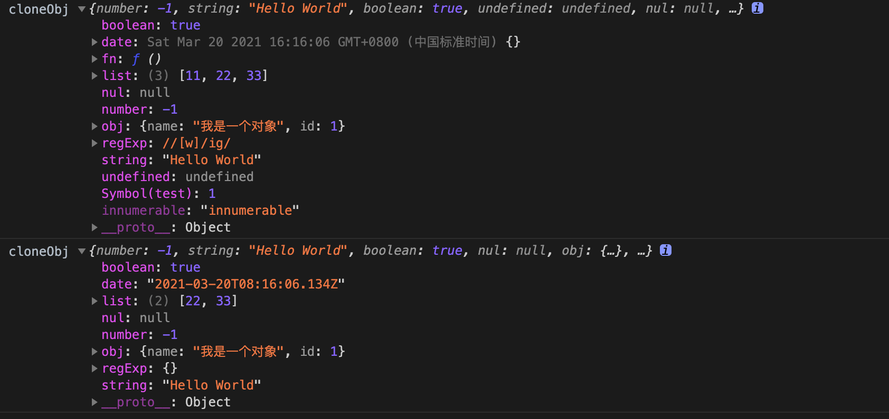
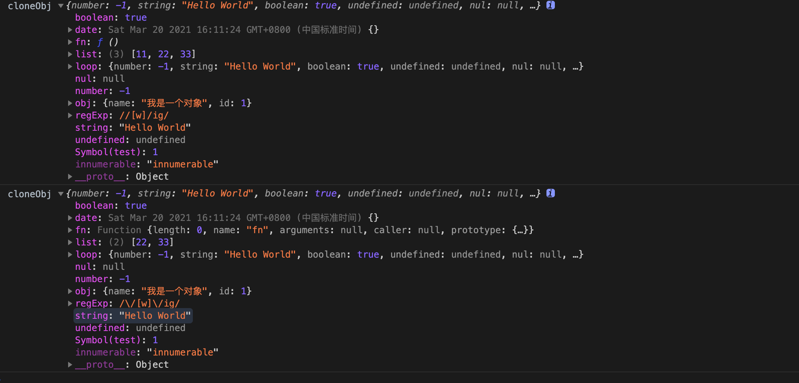

# 手写实现深浅拷贝


在平时开发中，一般处理两种数据类型:

* 基本数据类型
* 引用数据类型

基本数据类型存在栈中，引用数据类型存放在堆中。

在谈到深浅拷贝时，也是围绕这两种数据类型展开的。

## 浅拷贝

创建一个对象，重新复制或引用的源对象的值。

* 如果对象属性是基本的数据类型，复制的就是基本类型的值给新对象。
* 如果属性是引用数据类型，拷贝出来的目标对象的指针和源对象的指针指向的内存空间是同一块空间, 修改源对象同时也会对目标对象产生影响。

`JS` 提供了如下方法来对象和数据进行浅拷贝。

### 展开运算符

可以在函数调用/数组构造时, 将数组表达式或者 `string` 在语法层面展开；还可以在构造字面量对象时, 将对象表达式按 `key-value` 的方式展开。

``` js
// 数据的拷贝
let arr = [1, 2, 3, 4, {
    a: 1
}]
let arrCopy = [...arr]
arrCopy[4].a = 100
console.log(arrCopy[4].a) // 100
console.log(arr[4].a) // 100

// 对象的拷贝
let obj = {
    a: 1,
    b: {
        c: 3
    }
}
console.log(obj.b.c) // 3
let objCopy = {
    ...obj
}
objCopy.b.c = 4
console.log(obj.b.c) // 4
console.log(objCopy.b.c) // 4
```

不难发现数据类型都是基本类型，使用展开运算符拷贝非常方便。

### Object.assign

`Object.assign` 方法用于将所有可枚举属性的值从一个或多个源对象分配到目标对象。它将返回目标对象。

``` js
let t = {}
let s = {
    a: {
        b: 100
    }
}
Object.assign(t, s)
console.log(s.a.b) // 100
t.a.b = 200
console.log(s.a.b) // 200
console.log(t.a.b) // 200
```

需要注意的几个地方

* 不会拷贝对象的继承属性
* 不会拷贝对象的不可枚举的属性
* 可以拷贝 Symbol 类型的属性

`Object.assign` 会遍历原对象的属性，通过复制的方式将其赋值给目标对象的相应属性(包括 Symbol 类型的对象)

### 手写实现浅拷贝

对于基本类型直接进行拷贝复制，对于引用类型，在内存中开辟一块新的空间进行拷贝复制。

``` js
const isObject = (obj) => typeof obj === 'object' && obj !== null;

const shallowClone = (obj) => {
    if (!is(obj)) return obj
    const cloneObj = Array.isArray(obj) ? [] : {};
    for (let prop in obj) {
        if (obj.hasOwnProperty(prop)) {
            cloneObj[prop] = obj[prop];
        }
    }
    return cloneObj;
}
```

## 深拷贝

> 将一个对象从内存中完整地拷贝出来一份给目标对象，并从堆内存中开辟一个全新的空间存放新对象，且新对象的修改并不会改变原对象，二者实现真正的分离。

### JSON.stringfy

`JSON.stringfy` 是前端中最简单的深拷贝方式，把对象序列化成为 `JSON` 的字符串，并将对象里面的内容转换成字符串，再用 `JSON.parse` 将 `JSON` 字符串生成一个新的对象。

``` js
let obj1 = {
    a: 1,
    b: [1, 2, 3]
}
let str = JSON.stringify(obj1)；
let obj2 = JSON.parse(str)；
console.log(obj2); //{a:1,b:[1,2,3]} 
obj1.a = 2；
obj1.b.push(4);
console.log(obj1); //{a:2,b:[1,2,3,4]}
console.log(obj2); //{a:1,b:[1,2,3]}
```

但是 `JSON.stringfy` 在深拷贝会出现以下的问题:

* 拷贝的对象的值中如果有函数、`undefined`、`symbol` 这几种类型，经过 `JSON.stringify` 序列化之后的字符串中这个键值对会消失。
* 拷贝 `Date` 引用类型会变成字符串。
* 无法拷贝不可枚举的属性。
* 无法拷贝对象的原型链。
* 拷贝 `RegExp` 引用类型会变成空对象。
* 对象中含有 `NaN`、`Infinity` 以及 `-Infinity`，`JSON` 序列化的结果会变成 `null`。
* 无法拷贝对象的循环应用。

``` js
  let testObj = {
      [Symbol('test')]: 1,
      number: -1,
      string: 'Hello World',
      boolean: true,
      undefined: undefined,
      nul: null,
      obj: {
          name: '我是一个对象',
          id: 1
      },
      list: [11, 22, 33],
      fn: function() {
          console.log('Hello World')
      },
      date: new Date(),
      regExp: new RegExp('/[\w]/ig'),
  };
  Object.defineProperty(testObj, 'innumerable', {
      enumerable: false,
      value: 'innumerable'
  });
  obtestObjj = Object.create(testObj, Object.getOwnPropertyDescriptors(testObj))
  // 设置循环引用, 不能拷贝，将会报错
  // testObj.loop = testObj
  let cloneObj = JSON.parse(JSON.stringify(testObj))
  cloneObj.list.shift()
  console.log('cloneObj', testObj)
  console.log('cloneObj', cloneObj)
```



### 手写深拷贝

对于上述 `JSON.stringfy` 缺点，在实现深拷贝进行如下的改善：

* 当对象为 `Date`、`RegExp` 类型，直接返回一个新的实例。
* 对象的不可枚举和`symbol`属性，采用 `Reflect.ownKeys`。`Reflect.ownKeys`方法用于返回对象的所有属性，基本等同于`Object.getOwnPropertyNames`与`Object.getOwnPropertySymbols`之和。
* 无法拷贝对象的原型链对象，可以`Object.getPrototypeOf`获取对象的原型对象，以及对象的属性描述对象`Object.getOwnPropertyDescriptors`。
* 对于循环引用，可以采用`WeakMap`, `WeakMap` 是弱引用类型，可以有效防止内存泄漏。

``` js
const isComplexDataType = obj => (typeof obj === 'object' || typeof obj === 'function') && (obj !== null)

const deepClone = function(obj, hash = new WeakMap()) {
    // 处理 RegExp 对象
    if (obj.constructor === RegExp) return new RegExp(obj)
    // 处理 Date 对象
    if (obj.constructor === Date) return new Date(obj)
    // 处理循环引用
    if (hash.has(obj)) return hash.get(obj)
    // 获取属性的描述器
    let allDesc = Object.getOwnPropertyDescriptors(obj)
    // 创建新的对象，设置原型链
    let cloneObj = Object.create(Object.getPrototypeOf(obj), allDesc)
    // 处理循环引用
    hash.set(obj, cloneObj)
    // Reflect.ownKeys 可以获取不可枚举和 symbol 属性
    for (let key of Reflect.ownKeys(obj)) {
        cloneObj[key] = (isComplexDataType(obj[key]) ? deepClone(obj[key], hash) : obj[key]
        }
        return cloneObj
    }
}
```

接下来深拷贝测试

``` js
// 测试 对象
let testObj = {
    [Symbol('test')]: 1,
    number: -1,
    string: 'Hello World',
    boolean: true,
    undefined: undefined,
    nul: null,
    obj: {
        name: '我是一个对象',
        id: 1
    },
    list: [11, 22, 33],
    fn: function() {
        console.log('Hello World')
    },
    date: new Date(),
    regExp: new RegExp('/[\w]/ig'),
};
Object.defineProperty(testObj, 'innumerable', {
    enumerable: false,
    value: 'innumerable'
});
obtestObjj = Object.create(testObj, Object.getOwnPropertyDescriptors(testObj))
// 设置循环引用
testObj.loop = testObj
let cloneObj = deepClone(testObj)
cloneObj.list.shift()
console.log('cloneObj', testObj)
console.log('cloneObj', cloneObj)
```



可以看出解决了 `JSON.stringfy` 在进行深拷贝的时候的缺点。

## 总结

在平时开发过程，我们可以采用第三方库来实现深拷贝，比如 `loadsh.cloneDeep` 。
