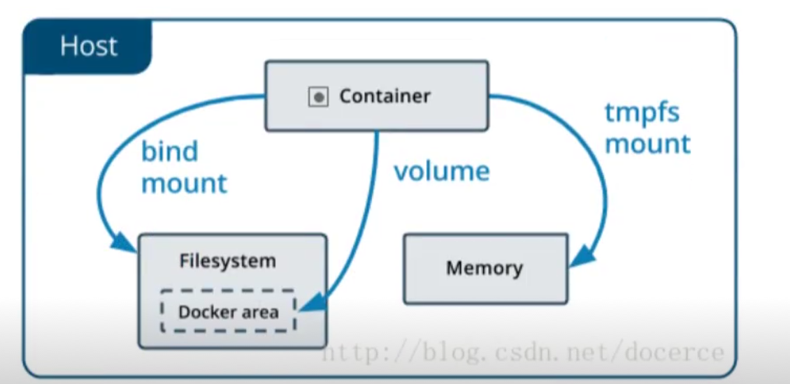

# Dokcer

##  软件部署问题

如果想让软件运行的起来要保证操作系统的设置正确。各种库和组件的安装都是正确的。

## 虚拟机

虚拟机就是带环境安装的一种解决方案。它可以再一个操作系统里运行另一个操作系统。如以下缺点：

* 占用资源多

* 冗余步骤多

* 启动速度慢

 

## Linux 容器

* 由于虚拟机存在这些缺点， `Linux` 发展出现了另一种虚拟技术： `Linux` 容器。
* `Linux` 容器不是模式一个完整的操作系统，而是对进程进行隔离。或者说，在正常的进程外面套了一个保护层。对于容器里面的进程来说，它接触的各种资源都是虚拟的，从而实现与操作系统的隔离。

    - 启动快

    - 资源占用小

    - 体积小

## Docker

 - `Docker` 属于 `Linux` 容器的一种封装。提供简单易用的容器使用接口。 他是目前最流程 `Linux` 容器解决方案。
 - `Docker` 将应用程序与该程序的依赖，打包在一个文件里。运行这个文件，就会生成一个虚拟容器。程序在这个虚拟容器里运行，就好像在真实的物理机运行一样。

 ## Docker 和 KVM

* 启动时间

  + `Docker` 秒级启动。

  + `KVM` 分钟明级别。

* 轻量级

  

  + 容器镜像像普通以 `M` 为单位，虚拟机以 `G` 为单位。容器资源占用小，要比虚拟机要部署更快。

  + 虚拟机需要虚拟化一些设备，具有完善的 `OS` , 具备完整的 `OS` 虚拟机开机开销大， 因而降低性能，没有容器性能好。

* 安全性

  + 由于共享主机内核，只是进程隔离，因为隔离性和稳定性不如虚拟机。容器具有一定权限访问宿主机内核，存在一定安全隐患。

* 使用要求

   - `KVM` 基于硬件的完整虚拟化，需要硬件 `CPU` 虚拟化支持技术。

   -  容器共享宿主主机内核，可运行在主机的 `Linux` 的发行版， 不用考虑 `CPU` 是否支持虚拟化技术。

## docker应用场景

* 节省项目换将部署时间

  + 单项目打包

  + 整套项目打包

  + 新开源技术

* 环境一致性

* 持续集成

* 微服务

* 弹性伸缩

## Docker体系结构

* `containerd` 是一个守护进程，使用 `runc` 管理容器，向 `Docker Engine` 提供接口。

* `shim` 指负责管理一个容器。

* `runC` 是一个轻量级工具，只用来运行容器。


## Docker安装

* `Docker` 分为企业版 `(EE)` 和 社区版 `(CE)`
* [docker](https://www.docker.com/)

* [hub.io](https://www.docker.com/products/docker-hub)

### 安装

[官网安装步骤](https://docs.docker.com/engine/install/centos/)

### 启动

``` sh
$ sudo systemctl start docker
```

### 查看Docker的版本

``` sh
$ docker version
```

### 卸载

[官网卸载步骤](https://docs.docker.com/engine/install/centos/)

## Dokcer架构


## 阿里云加速

## docker命令参考

[官方参考](https://docs.docker.com/engine/reference/commandline/docker/)

## image镜像

* `Docker` 把应用程序及其依赖，打包在 `image` 文件里面。只有通过这个文件，才能生成 `Docker` 容器。

* `image` 可以看作是容器的模板。

* `Docker` 根据 `image` 文件生成容器的实例。

* 同一个 `image` 文件，可以生成多个同时运行的容器实例。

* 镜像不是一个一个文件，而是有层的。

* 容器其实就是在镜像的最上面加了一层读写层， 在运行容器里做得任何文件改动，都会写到这个读写层里。如果容器删除了，最上面的读写层也就删除了，改动也就丢失了。

* 我们可以通过 `docker history <ID/NAME>` 查看镜像中的各层内容及大小。每层对应着 `Dockerfile` 中的一条指令。

### 命令

| 命令     | 含义 |  语法 |     
| :--------- | :-- | --- |  
| ls | 查看全部镜像 | docker image ls |
| search  | 查看镜像历史  | docker search [imageName]  |
| history | 查看镜像历史  | docker history [imageName] |
| inspect | 显示一个或多个镜像的详细信息  | docker inspect [imageName] |
| pull | 拉去镜像  | docker pull [imageName] |
| push | 推动一个镜像到镜像仓库  | docker push [imageName] |
| rmi | 删除镜像  | docker rmi [imageName] |
| prune | 移除未使用的镜像， 没有标记或任何容器引用  | docker image prune |
| tag | 标记本地镜像, 将其归入某一个仓库  | docker image tag [imageName][username]/[repository]:[tag]|
| export | 导出容器文件系统 `tar` 归档文件创建镜像 | docker export -o mysqlv1.tar a404c6c174a2|
| import | 导入容器快照文件系统 `tar` 归档文件创建镜像 | docker import -o mysqlv1.tar qianduan/mysql:v2|
| save | 保存一个或多个镜像到一个 `tar` 归档文件 | docker save -o  mysqlv2.tar qianduan/mysqlv2:v3|
| load | 加载镜像存储文件来自 `tar` 归档或者标准输入 | docker load -i mysqlv2:tar |
| build | 根据 `docker` 构建镜像|  |

::: warning

* 用户既可以使用 `docker load` 来带入镜像存储文件到本地镜像库，也可以使用 `docker import` 来导入一个容器快照到本地镜像仓库。

* 这两者的区别在于容器快照文件将丢弃所有的历史记录和元数据信息（即仅保存容器当时的快照状态）， 而镜像存储文件将保存完整的记录，体积也大。

* 此外，从容器快照文件导入时可以重新指定标签等元数据信息。

:::

### 查看本地镜像

``` sh
[root@iZm5eeens8iab3xz6f0rfiZ ~]# systemctl start docker.service
[root@iZm5eeenbs8iab3xz6f0rfiZ ~]# docker image ls 
REPOSITORY          TAG                 IMAGE ID            CREATED             SIZE
node                latest              173eeb895217        9 days ago          943MB
nginx               latest              7e4d58f0e5f3        10 days ago         133MB
hello-world         latest              bf756fb1ae65        8 months ago        13.3kB
```

|字段|含义|
|---|---|
|REPOSITORY |仓库地址|
|TAG        |标签|
| IMAGE ID  |镜像ID|
| CREATED   |创建时间|
| SIZE      |镜像大小|

### 查找镜像

``` sh
REPOSITORY          TAG                 IMAGE ID            CREATED             SIZE
[root@iZm5eeens8iab3xz6f0rfiZ ~]# docker search  node
NAME                                   DESCRIPTION                                     STARS               OFFICIAL            AUTOMATED
node                                   Node.js is a JavaScript-based platform for s…   9223                [OK]                
mongo-express                          Web-based MongoDB admin interface, written w…   773                 [OK]                
...
```

|字段|含义|
|---|---|
|NAME        |名称|
|DESCRIPTION |描述|
|STARS       |星星数|
| OFFICIAL   |是否是官方源|

### 拉取镜像

``` sh
[root@iZ2ze4re2plzzckpd3iu6pZ ~]# docker image  pull ubuntu
Using default tag: latest
latest: Pulling from library/ubuntu
a95689b8e6cb: Download complete 
1a0022e444c2: Download complete 
32b7488a3833: Download complete 
Digest: sha256:bc2f7250f69267c9c6b66d7b6a81a54d3878bb85f1ebb5f951c896d13e6ba537
Status: Downloaded newer image for ubuntu:latest
docker.io/library/ubuntu:latest
```

* `docker image pull` 是抓取 `image` 文件的命令。

* `docker.io/hello-world` 是 `image` 文件在仓库里面的位置，其中 `docker.io` 是 `image` 的作者， `hello-world` 是 `image` 文件的名字。

* `Docker` 官方提供的 `image` 文件，都放在 `docker.io` 组里面，所以他是默认组，可以省略 `docker image pull hello-world`

### 查看镜像的历史信息

``` sh
[root@iZ2ze4re2plzzckpd3iu6pZ ~]# docker image history ubuntu
IMAGE               CREATED             CREATED BY                                      SIZE                COMMENT
9140108b62dc        2 weeks ago         /bin/sh -c #(nop)  CMD ["/bin/bash"]            0B                  
<missing>           2 weeks ago         /bin/sh -c mkdir -p /run/systemd && echo 'do…   7B                  
<missing>           2 weeks ago         /bin/sh -c [ -z "$(apt-get indextargets)" ]     0B                  
<missing>           2 weeks ago         /bin/sh -c set -xe   && echo '#!/bin/sh' > /…   811B                
<missing>           2 weeks ago         /bin/sh -c #(nop) ADD file:da80f59399481ffc3…   72.9MB    
```

### 查看镜像的详细信息

``` sh
[root@iZ2ze4re2plzzckpd3iu6pZ ~]# docker image inspect ubuntu
[
    {
        "Id": "sha256:9140108b62dc87d9b278bb0d4fd6a3e44c2959646eb966b86531306faa81b09b",
        "RepoTags": [
            "ubuntu:latest"
        ],
        "RepoDigests": [
            "ubuntu@sha256:bc2f7250f69267c9c6b66d7b6a81a54d3878bb85f1ebb5f951c896d13e6ba537"
        ],
        "Parent": "",
        "Comment": "",
        "Created": "2020-09-25T22:34:30.295807036Z",
        "Container": "1046a5d685aef5c37d1829040ca8083b94e4c069ca4963f4b16a6ade2e077b06",
        "ContainerConfig": {
            "Hostname": "1046a5d685ae",
            "Domainname": "",
            "User": "",
            "AttachStdin": false,
            "AttachStdout": false,
            "AttachStderr": false,
            "Tty": false,
            "OpenStdin": false,
            "StdinOnce": false,
            "Env": [
                "PATH=/usr/local/sbin:/usr/local/bin:/usr/sbin:/usr/bin:/sbin:/bin"
            ],
            "Cmd": [
                "/bin/sh",
                "-c",
                "#(nop) ",
                "CMD [\"/bin/bash\"]"
            ],
            "ArgsEscaped": true,
            "Image": "sha256:4ff2090064e7e38688bce713d50f3202d227b3c89fecea1434271c912ccd47e0",
            "Volumes": null,
            "WorkingDir": "",
            "Entrypoint": null,
            "OnBuild": null,
            "Labels": {}
        },
        "DockerVersion": "18.09.7",
        "Author": "",
        "Config": {
            "Hostname": "",
            "Domainname": "",
            "User": "",
            "AttachStdin": false,
            "AttachStdout": false,
            "AttachStderr": false,
            "Tty": false,
            "OpenStdin": false,
            "StdinOnce": false,
            "Env": [
                "PATH=/usr/local/sbin:/usr/local/bin:/usr/sbin:/usr/bin:/sbin:/bin"
            ],
            "Cmd": [
                "/bin/bash"
            ],
            "ArgsEscaped": true,
            "Image": "sha256:4ff2090064e7e38688bce713d50f3202d227b3c89fecea1434271c912ccd47e0",
            "Volumes": null,
            "WorkingDir": "",
            "Entrypoint": null,
            "OnBuild": null,
            "Labels": null
        },
        "Architecture": "amd64",
        "Os": "linux",
        "Size": 72875723,
        "VirtualSize": 72875723,
        "GraphDriver": {
            "Data": {
                "LowerDir": "/var/lib/docker/overlay2/4c837e528b1c7846646a1654de43cc22ab3ea6e8a520f5e55748666703273208/diff:/var/lib/docker/overlay2/8c280d4fed0d7ab2674855083d0de12cb9cb4c00bc075bb0ff6a34d7158c2559/diff",
                "MergedDir": "/var/lib/docker/overlay2/a86ce81b59de68c37663108a0a549a59215e3d5c6d6173fb0dead7f469accaa5/merged",
                "UpperDir": "/var/lib/docker/overlay2/a86ce81b59de68c37663108a0a549a59215e3d5c6d6173fb0dead7f469accaa5/diff",
                "WorkDir": "/var/lib/docker/overlay2/a86ce81b59de68c37663108a0a549a59215e3d5c6d6173fb0dead7f469accaa5/work"
            },
            "Name": "overlay2"
        },
        "RootFS": {
            "Type": "layers",
            "Layers": [
                "sha256:d42a4fdf4b2ae8662ff2ca1b695eae571c652a62973c1beb81a296a4f4263d92",
                "sha256:90ac32a0d9ab11e7745283f3051e990054616d631812ac63e324c1a36d2677f5",
                "sha256:782f5f011ddaf2a0bfd38cc2ccabd634095d6e35c8034302d788423f486bb177"
            ]
        },
        "Metadata": {
            "LastTagTime": "0001-01-01T00:00:00Z"
        }
    }
]
```

### 删除镜像

``` sh
docker rmi hello-world
```

### import和export

* `export` 导出容器到文件。

* `import` 把文件导入为镜像。

``` sh
[root@iZ2ze4re2plzzckpd3iu6pZ ~]# docker container run ubuntu
[root@iZ2ze4re2plzzckpd3iu6pZ ~]# docker container ps -al
CONTAINER ID        IMAGE               COMMAND             CREATED             STATUS                      PORTS               NAMES
1bc2e2ae106a        ubuntu              "/bin/bash"         21 seconds ago      Exited (0) 19 seconds ago                       youthful_varahamihira
[root@iZ2ze4re2plzzckpd3iu6pZ ~]# docker  export -o  ubuntu.tar 1bc2e2ae106a
[root@iZ2ze4re2plzzckpd3iu6pZ ~]# ls  | grep ubuntu.tar
ubuntu.tar
[root@iZ2ze4re2plzzckpd3iu6pZ ~]# docker import ubuntu.tar -m "new" my/myubuntu
sha256:57e1ced135bc7895b9d5a1a8166fc1bb927838db31ccf6fd0b41f437e2f5ad85
[root@iZ2ze4re2plzzckpd3iu6pZ ~]# docker image ls 
REPOSITORY          TAG                 IMAGE ID            CREATED             SIZE
my/myubuntu         latest              57e1ced135bc        12 seconds ago      72.9MB
myubuntu            v1                  39605eb3b48d        55 minutes ago      72.9MB
```

### save和load

* `save` 保存镜像所有的信息-包含历史。

* `load` 只导出当前的信息。

``` sh
[root@iZ2ze4re2plzzckpd3iu6pZ ~]# docker image ls
REPOSITORY          TAG                 IMAGE ID            CREATED             SIZE
hello-world         latest              bf756fb1ae65        9 months ago        13.3kB
[root@iZ2ze4re2plzzckpd3iu6pZ ~]# docker save -o my-hello-world.tar hello-world  
[root@iZ2ze4re2plzzckpd3iu6pZ ~]# ls  | grep my-hello-world.tar
my-hello-world.tar
[root@iZ2ze4re2plzzckpd3iu6pZ ~]# docker image rmi -f  hello-world 
Untagged: hello-world:latest
Untagged: hello-world@sha256:4cf9c47f86df71d48364001ede3a4fcd85ae80ce02ebad74156906caff5378bc
Deleted: sha256:bf756fb1ae65adf866bd8c456593cd24beb6a0a061dedf42b26a993176745f6b
[root@iZ2ze4re2plzzckpd3iu6pZ ~]# docker load -i  my-hello-world.tar
Loaded image: hello-world:latest
[root@iZ2ze4re2plzzckpd3iu6pZ ~]# docker image ls 
REPOSITORY          TAG                 IMAGE ID            CREATED             SIZE
hello-world         latest              bf756fb1ae65        9 months ago        13.3kB
```

## 容器

* `  run` 命令会从 `image` 文件， 生成一个正在运行的容器实例。

* `docker container run` 命令具有自动抓取 `image` 文件的功能。如果发现本地没有指定的 `image` 文件，就会自动从仓库拉去。

* 输入提示后， `hello world` 就会停止运行，容器自动终止。

* 有些容器不会自动停止。

* `image` 文件生成容器实例，文本也是一个文件，成为容器文件。

* 容器生成，就会同时存在两个文件: `image` 文件和容器文件。

* 关闭容器并不会删除容器文件，只是容器停止运行。

### 命令

| 命令     | 含义 |  语法 |     
| :--------- | :-- | --- |  
| run | 从镜像运行一个容器 | docker run hello-world |
| ls  | 列出容器  | docker container  ls |
| inspect  | 显示一个或者多个容器详细信息  | docker inspect |
| stats  | 显示容器资源使用统计 | docker container stats |
| top  | 显示一个容器运行的进程 | docker container top |
| update  | 显示一个容器运行的进程 | docker container update |
| port  | 列出指定的容器的端口映射 | docker container port |
| ps  | 查看当前运行的容器 | docker ps -a -l |
| kill [containerId]  | 终止容器（发送SIGKILL） | docker kill [containerId] |
| rm [containerId]  | 删除容器 | docker rm [containerId] |
| start [containerId]  | 启动已经生成、已经停止运行的容器文件 | docker start [containerId] |
| stop [containerId]  | 终止容器运行（发送 SIGTERM） | docker stop [containerId] |
| logs [containerId]  | 查看 `docker` 容器的输出 | docker logs [containerId] |
| attach              | 要attach上去的容器必须正在运行，可以同时连接上同一个 `container` 来共享屏幕 | docker attach |
| exec [containerId]  | 进入一个正在运行的 `docker` 容器执行命令 | docker container  exec  -it [containerId] /bin/bash|
| cp [containerId]  | 从正在运行的 `Dokcer` 容器里，将文件拷贝到本地 | docker container  cp -it [containerId]:app/package.josn|
| commit [containerId]  | 创建一个新镜像来自容器 | docker container  commit -a “qianduan” -m “mysql” 5da48d5a1349　mynginx:v1|

* `docker` 容器的主线程 `(dockfile中CMD执行名称)` 结束，容器就会推出。

   - 以交互式启动 `docker run -i [CONTAINER_NAME or CONTAINER_ID]`
   - tty选项 `docker run -dit [CONTAINER_NAME or CONTAINER_ID]`
   - 守护态(Daemonized)形式运行 `docker run -d ubuntu /bin/sh -c "while true; do echo hello world;sleep1;done"`

### 启动容器

``` sh
docker run ubuntu /bin/echo "Hello world"
```

* `docker: Docker` 的二进制执行文件。

* `run:` 与前面的 `docker` 组合起来运行一个容器。

* `ubuntu` 指定要运行的镜像， `Docker` 首先从本地主机上查找镜像是否存在，如果不存在， `Docker` 就会从镜像仓库 `Docker hub` 下载公共镜像。

* `/bin/echo Hello world` 在容器里执行的命令。

* 选项

|参数|含义|
|---|---|
|-i --interactive      |交互式|
|-t --tty              |分配一个伪终端|
|-d --detach           |运行容器到后台|
|-a --attch list       |附加到运行的容器|
|-e --env list         |设置环境变量|
|-p --public list      |发布容器到主机|
|-P                    |--public-all |
|--mount   mount       |挂载宿主机分区到容器|
|-v  --volumn  list    |挂载宿主机分区到容器|
|-rm                   |一旦容器运行完，就自动删除容器文件|

### 运行交互式的容器

``` sh
[root@iZ2ze4re2plzzckpd3iu6pZ ~]# docker run -it ubuntu /bin/bash 
root@9cf4fe02207a:/# cd /root
root@9cf4fe02207a:~# touch a.txt
root@9cf4fe02207a:~# exit   # 退出容器
exit
[root@iZ2ze4re2plzzckpd3iu6pZ ~]# 
```

### 查看容器

* `docker container ps` 默认只展示正在运行的容器。
* 显示所有的容器（运行和停止） `-a` 。

``` sh
[root@iZ2ze4re2plzzckpd3iu6pZ ~]# docker container ps -al
CONTAINER ID        IMAGE               COMMAND             CREATED             STATUS                    PORTS               NAMES
5da48d5a1349        hello-world         "/hello"            46 hours ago        Exited (0) 46 hours ago                       elastic_allen
```

* `-a` 显示所有的容器，包括已停止的。

* `-l` 显示最新的那个容器。

|字段|含义|
|--|---|
|CONRAINER ID|容器ID|
|IAMGE       |使用的镜像|
|COMMAND     |使用的命令|
|CREATED     |创建时间|
|STATUS      |状态|
|PORTS       |端口号|
|NAMES       |自动分配的名称|

### 后台运行容器

``` sh
root@iZ2ze4re2plzzckpd3iu6pZ ~]# docker run -d -p 8080:80 nginx
```

### -p与-P

docker容器在启动的时候，如果不指定端口映射参数，在容器外部是无法通过网络来访问容器内的网络应用和服务的。

* `-p` 小写

则可以指定要映射的IP和端口，但是在一个指定端口上只可以绑定一个容器。

``` sh
root@iZ2ze4re2plzzckpd3iu6pZ ~]# docker run -p 8080:80 nginx
```

* `-P` 小写

Docker 会随机映射一个 49000~49900 的端口到内部容器开放的网络端口。

``` sh
root@iZ2ze4re2plzzckpd3iu6pZ ~]# docker run -P 8080:80 nginx
```

### env

* 指定环境变量。

``` sh
[root@iZ2ze4re2plzzckpd3iu6pZ ~]# docker  run -it -e name=qianduan ubuntu
root@e3c27091fe81:/# echo $name
qianduan
```

### kill

``` sh
docker stop　5da48d5a1349　   # 给容器发送结束信号
docker kill　5da48d5a1349　　　# 直接停止 ，不发请求
```

### 删除容器

``` sh
root@iZ2ze4re2plzzckpd3iu6pZ ~]# docker container rm 5da48d5a1349  # 删除指定id容器
root@iZ2ze4re2plzzckpd3iu6pZ ~]# docker container rm $( docker ps -a -q )  # 删除所有的容器
```

### 自动删除容器

* 在执行 `docker run` 的时候如果添加 `--rm` 参数，则容器终止后会立刻删除。

* `--rm` 参数和 `-d` 参数不能同时使用。

``` sh
root@iZ2ze4re2plzzckpd3iu6pZ ~]# docker run -it --rm ubuntu /bin/bash
```

### 进入一个正在运行的容器

进入Docker容器比较常见的几种做法如下：

* docker attach

``` sh
[root@iZ2ze4re2plzzckpd3iu6pZ ~]# docker run -itd ubuntu /bin/bash  
0206a0d51735d9dea6d8a42387570c67f58fb09b1414e1c813478698a2999f44
[root@iZ2ze4re2plzzckpd3iu6pZ ~]#  docker container ps
CONTAINER ID        IMAGE               COMMAND             CREATED              STATUS              PORTS               NAMES
0206a0d51735        ubuntu              "/bin/bash"         About a minute ago   Up About a minute                       optimistic_saha
[root@iZ2ze4re2plzzckpd3iu6pZ ~]# docker attach  0206a0d51735d9dea6d8a42387570c67f58fb09b1414e1c813478698a2999f44
root@0206a0d51735:/# 
```

但在，使用该命令有一个问题。当多个窗口同时使用该命令进入该容器时，所有的窗口都会同步显示。如果有一个窗口阻塞了，那么其他窗口也无法再进行操作。
因为这个原因，所以docker attach命令不太适合于生产环境，平时自己开发应用时可以使用该命令。

* docker exec

docker在1.3. X版本之后还提供了一个新的命令exec用于进入容器，这种方式相对更简单一些。

``` sh
[root@iZ2ze4re2plzzckpd3iu6pZ ~]#  docker container  exec -it 0206a0d51735d9dea6d8a42387570c67f58fb09b1414e1c813478698a2999f44 /bin/bash
```

### 拷贝文件

* 从容器内拷贝文件到主机上。

``` sh
docker cp 4db8edd86202:/usr/share/elasticsearch/config/elasticsearch.yml /home/haopeng/es
```

### 创建一个新的镜像

* 创建一个新镜像来自容器。

``` sh
[root@iZ2ze4re2plzzckpd3iu6pZ ~]# docker container ls -al
CONTAINER ID        IMAGE               COMMAND             CREATED             STATUS                      PORTS               NAMES
3bea777f1408        9140108b62dc        "/bin/bash"         18 seconds ago      Exited (0) 18 seconds ago                       jovial_kepler
# -a 指定作者
# -m 指定注释
# myubuntu:v1  myubuntu 镜像的名字 v1指定镜像的tag
[root@iZ2ze4re2plzzckpd3iu6pZ ~]# docker  container commit -a "wo" -m "dierban" 3bea777f1408 myubuntu:v1
sha256:39605eb3b48d5c5defd5aa484070e14b9e99706b5dd1078ce4e3ca0a9d9fb821
[root@iZ2ze4re2plzzckpd3iu6pZ ~]# docker image ls
REPOSITORY          TAG                 IMAGE ID            CREATED              SIZE
myubuntu            v1                  39605eb3b48d        3 seconds ago        72.9MB
ubuntu              latest              9140108b62dc        2 weeks ago          72.9MB
hello-world         latest              bf756fb1ae65        9 months ago         13.3kB
```

## commit制作个性化镜像

* `docker container commit` 从容器创建一个新的镜像。

* `docker container commit [options] CONTAINER [REPOSITORY [:TAG]]`
   - `-a` 提交的镜像作者。

   - `-c` 使用 `Dockerfile` 来创建镜像

   - `-m` 提交时的说明文字。

   - `-p` 在 `commit` 时将，将容器暂停。

* 停止容器后不会自动删除容器， 除非在启动容器的时候指定了 `--rm` 标志。

* 使用 `docker ps -a` 命令查看 `Docker` 主机上包含停止的容器在内的所有容器。

*  停止状态的容器的可写层仍然占用磁盘。要清理可以使用 `docker container prune` 命令。

``` sh
[root@iZ2ze4re2plzzckpd3iu6pZ ~]# runoob@runoob:~$ docker commit -a "runoob.com" -m "my apache" a404c6c174a2  mymysql:v1 
sha256:37af1236adef1544e8886be23010b66577647a40bc02c0885a6600b33ee28057
[root@iZ2ze4re2plzzckpd3iu6pZ ~]# runoob@runoob:~$ docker images mymysql:v1
REPOSITORY          TAG                 IMAGE ID            CREATED             SIZE
mymysql             v1                  37af1236adef        15 seconds ago      329 MB
```

## 制作Dockerfile

* `Docker` 的镜像是一层一层的文件组成作用。

* `docker inspect` 命令可以查看镜像或者容器。

* `Layers` 就是镜像的层文件，只能读不能修改。基于镜像创建的容器会共享这些文件层。

``` sh
``` sh
[root@iZ2ze4re2plzzckpd3iu6pZ ~]# docker image inspect ubuntu
[
    {
        "Id": "sha256:9140108b62dc87d9b278bb0d4fd6a3e44c2959646eb966b86531306faa81b09b",
        "RepoTags": [
            "ubuntu:latest"
        ],
        ...
            "Cmd": [
                "/bin/sh",
                "-c",
                "#(nop) ",
                "CMD [\"/bin/bash\"]"
            ],
            ...
        },
        "DockerVersion": "18.09.7",
        "Author": "",
        ...
        },
        "RootFS": {
            "Type": "layers",
            "Layers": [
                "sha256:d42a4fdf4b2ae8662ff2ca1b695eae571c652a62973c1beb81a296a4f4263d92",
                "sha256:90ac32a0d9ab11e7745283f3051e990054616d631812ac63e324c1a36d2677f5",
                "sha256:782f5f011ddaf2a0bfd38cc2ccabd634095d6e35c8034302d788423f486bb177"
            ]
        },
        "Metadata": {
            "LastTagTime": "0001-01-01T00:00:00Z"
        }
    }
]
```

### 编写Dockerfile

|命令|含义|案例|
|--|--|---|
| FROM      | 继承的镜像     | FROM node  |
| COPY      | 拷贝          | COPY ./app ./app  |
| WORKDIR   | 指定工作路径    |  WORKDIR /app |
| RUN       | 编译打包阶段运行命令 |  RUN npm  install  |
| EXPOSE    | 暴露端口       |  EXPOSE 3000  |
| CMD       | 容器运行阶段运行命令       |  EXPOSE npm run start  |

### dockerignore

* 表示要排除，不要打包到 `image` 中的文件路径。

``` sh
.git
node_modules
```

### Dockerfile

#### 安装node

``` sh
# 下载nvm
[root@iZ2ze4re2plzzckpd3iu6pZ ~]# wget -qO- https://raw.githubusercontent.com/nvm-sh/nvm/v0.36.0/install.sh | bash
# 永久生效npm命令
[root@iZ2ze4re2plzzckpd3iu6pZ ~]# source /root/.bashrc
# 安装 node 最新稳定版
[root@iZ2ze4re2plzzckpd3iu6pZ ~]# nvm install stable
[root@iZ2ze4re2plzzckpd3iu6pZ ~]# node -v
[root@iZ2ze4re2plzzckpd3iu6pZ ~]# npm install cnpm -g
[root@iZ2ze4re2plzzckpd3iu6pZ ~]# cnpm install nrm -g
```

#### 安装express项目生成器

``` sh
[root@iZ2ze4re2plzzckpd3iu6pZ ~]#  cnpm i express-generator -g
[root@iZ2ze4re2plzzckpd3iu6pZ ~]#  express app
```

#### Dockerfile

``` yml
FORM    node
COPY    ./app /app
WOEKDIR /app
RUN     npm install
EXPOSE  3000
CMD  npm start
```

* `FROM` 表示该镜像继承的镜像 `:` 表示标签。

* `COPY` 是当前项目下的 `app` 目录下面的文件都拷贝 `image` 里的 `/app` 目录中。

* `WORKDIR` 指定工作目录，类似于执行 `cd` 命令。

* `RUN npm install` 在 `/app` 目录下安装依赖，安装后的依赖，也会打包到 `image` 中。在编译镜像时候执行的，可以指定多条。

* `EXPOSE` 暴露 `3000` 端口，允许外部连接这个端口。

* `CMD  npm start` 在启动容器时执行，只能有一个。如果启动的时候传递 `/bin/bash` , 那么 `CMD` 将不再执行。

### 创建image

``` sh
[root@iZ2ze4re2plzzckpd3iu6pZ ~]# docker build -t express-demo .
```

* `-t` 用来指定 `image` 镜像的名字，后面还可以加冒号指定标签，如果不加默认指定 `lastest` 。

* `.` 表示 `Dockerfile` 文件的所在路径， `.` 表示当前路径。

### 使用新的镜像运行容器

``` sh
[root@iZ2ze4re2plzzckpd3iu6pZ ~]# docker container run -d -p 3333:3000 -it express-demo 
```

### CMD

 `Dockerfile`

``` YML
CMD npm  start
```

``` sh
docker build -t express-demo .
```

* `RUN` 命令在 `image` 文件构建阶段执行，执行结果都会被打打包进入 `image` 文件。

* `CMD` 命令是在容器启动后自动执行。

* 一个 `Dockerfile` 可以打包多个 `RUN` 命令，但是只能有一个 `CMD` 命令。

* 指定了 `CMD` 命令以后， `docker container run` 命令就不能再附加命令了, 比如前面的 `/bin/bash` , 否则就会被覆盖掉。

### 提交镜像

1. [注册账号]()

2. `docker tag SOURCE_IMAGE[: TAG] TARGET_IMAGE[: TAG]`

``` sh
docker login
docker image tag [imageName] [usrName]/[repository]:[tag]
docker image build -t [username]/[repository]:[tag]

docker tag express-demo quanduan/express-demo:v1
docker push quanduan/express-demo:v1
```

## 数据盘

* 删除容器的时候，容器层创建的文件也会被删除，如果有些数据你想永久保存，比如 `web` 服务器日志，数据库管理系统中的数据，可以为容器创建一个数据盘。



### volume

* `volumes Docker` 管理宿主机文件系统的一部分( `/var/lib/docker/volumes` )。

* 如果没有指定数据卷，则会自动创建。

* 建议使用 `--mount` ，更通用。

### 创建数据卷 

``` sh
[root@iZ2ze4re2plzzckpd3iu6pZ ~]# docker volume --help

Usage:  docker volume COMMAND

Manage volumes

Commands:
  create      Create a volume
  inspect     Display detailed information on one or more volumes
  ls          List volumes
  prune       Remove all unused local volumes
  rm          Remove one or more volumes
[root@iZ2ze4re2plzzckpd3iu6pZ ~]#  docker volume create nginx-logger  #创建数据源， 创建完在哪里呢？
nginx-logger
[root@iZ2ze4re2plzzckpd3iu6pZ ~]# docker volume ls
DRIVER              VOLUME NAME
local               nginx-logger
[root@iZ2ze4re2plzzckpd3iu6pZ ~]# docker volume inspect nginx-logger
[
    {
        "CreatedAt": "2020-10-17T22:42:09+08:00",
        "Driver": "local",
        "Labels": {},
        "Mountpoint": "/var/lib/docker/volumes/nginx-logger/_data", #  在宿主机这个位置。
        "Name": "nginx-logger",
        "Options": {},
        "Scope": "local"
    }
]
[root@iZ2ze4re2plzzckpd3iu6pZ ~]# cd /var/lib/docker/volumes/nginx-logger/_data
[root@iZ2ze4re2plzzckpd3iu6pZ _data]# ls -al
total 0
drwxr-xr-x 2 root root  6 Oct 17 22:42 .
drwxr-xr-x 3 root root 19 Oct 17 22:42 ..
```

``` sh
# 把 nginx-logger 数据卷挂载到/usr/share/nginx/html,挂载后容器内的文件会同步到数据卷中。
# 第一种挂载方法
docker run -d --name nginx1 --mount src=nginx-logger,dst=/usr/share/nginx/html nginx
# 第二种挂载方法
docker run -d --name nginx2 -v snginx-logger:/usr/share/nginx/html -p 3000:80 nginx
```

### 删除数据卷

``` sh
docker container stop nginx1
docker container rm nginx1
docker volume rm nginx-logger
```

### 管理数据卷

``` sh
docker volume ls # 列出所有的数据卷
docker volume ls -f dangling=true #列出已经孤立的数据盘
docker volume rm xxxx # 删除数据盘
```

### Bind mounts

* 此方式与 `Linux` 系统的 `mount` 方式很类似，即是会覆盖容器内已经存在的目录或文件，但并不会改变容器内原有的文件，

当 `unmount` 后容器内的文件就会被还原。

* 创建容器的时候我们可以通过 `-v` 或 `--volumn` 给他指定一下数据盘。

* `bind mounts` 可以存储在宿主机系统的任意位置。

* 如果源文件/目录 不存在，不会自动创建，会抛出一个错误。

* 如果挂载目标在容器中非空目录，则该目录现有内容将被隐藏。

#### 默认数据盘

* `-v` 参数两种挂载数据卷方式都以使用。

``` sh
docker run -v /mnt:/mnt -it --name logs centos bash
cd /mnt
echo 1 > 1.txt
exit
```

``` sh
docker volume inspect logs
”Mounts“:[
  {
    "Source":"xxxx",
    "Destination":"xxxx",
  }
]
```

* `Source` 的值就是我们给容器指定在数据盘在主机上的位置。

* `Destination` 的值是这个数据盘在容器上的位置。

#### 指定数据盘

``` sh
mkdir ~/data
docker run -v ~/data:/mnt -it --name log2 centos bash
cd /mnt
echo 3 > 3.txt
exit 
cat ~/data/3.txt
```

* `~/data:/mnt` 把当前用户目录中的 `data` 映射到 `/mnt` 上。

#### 指定数据盘容器

``` sh
docker create -v /mnt:/mnt --name logger centos
docker run --volumes-from logger --name logger3 -i -t centos bash
cd /mnt
touch logger3
docker run --volumes-from logger --name logger4 -i -t centos bash
cd /mnt
touch logger4
```

## 网络

* 安装 `Docker` 时，它会自动创建三个网络， `bridge` (创建容器默认连接到此网络)、 `none` 、 `host` 。

   - `None` 该模式关闭了容器的网络功能，外界完全隔离。

   - `host` 容器将不会虚拟出自己的网卡，配置自己的 `IP` 等，而是使用宿主机的 `IP` 和端口。

   - `bridge` 桥接网络， 此模式会为每一个容器分配 `IP` 。

* 可以使用该 `--network` 标志来指定容器应连接到哪些网络。

``` sh
[root@iZ2ze4re2plzzckpd3iu6pZ ~]# docker network ls
NETWORK ID          NAME                DRIVER              SCOPE
8f8c1a11be31        bridge              bridge              local
5a0e2586cf43        host                host                local
6b1d0450471f        none                null                local
```

### bridge

* `bridge` 网络代表所有 `Docker` 安装中存在的网络。

* 除非你使用该 `docker run  --network=<NETWORK>` 选项指定，否则 `Docker` 守护进程默认将容器连接到此网络。

* `bridge` 模式使用 `--new=bridge` ，默认设置。

``` sh
docker network ls
docker inspect bridge
docker run  -d --name nginx1 nginx
docker run  -d --name nginx2 --link nginx1 nginx
docker exec -it nginx2 bash
apt update
apt install -y inetutils   #ping
apt install -y dnsutils    #nslookup
apt install -y net- tools  #ifconfig
apt install -y iproute2    #ip
apt install -y curl        #curl
cat /ect/hosts
ping nginx1
```

``` sh
[root@iZ2ze4re2plzzckpd3iu6pZ ~]# docker inspect bridge
[
    {
        "Name": "bridge",
        "Id": "8f8c1a11be31eb3a225a4d8d8c2318a816b6620c1b4ef3541f563390a4007881",
        "Created": "2020-10-12T22:48:51.019627791+08:00",
        "Scope": "local",
        "Driver": "bridge",
        "EnableIPv6": false,
        "IPAM": {
            "Driver": "default",
            "Options": null,
            "Config": [
                {
                    "Subnet": "172.17.0.0/16"
                }
            ]
        },
        "Internal": false,
        "Attachable": false,
        "Ingress": false,
        "ConfigFrom": {
            "Network": ""
        },
        "ConfigOnly": false,
        "Containers": {},
        "Options": {
            "com.docker.network.bridge.default_bridge": "true",
            "com.docker.network.bridge.enable_icc": "true",
            "com.docker.network.bridge.enable_ip_masquerade": "true",
            "com.docker.network.bridge.host_binding_ipv4": "0.0.0.0",
            "com.docker.network.bridge.name": "docker0",
            "com.docker.network.driver.mtu": "1500"
        },
        "Labels": {}
    }
]
```

### none

* `none` 模式使用 `--net=none`

``` sh
docker run -d --name nginx_none --net none nginx
docker inpsect none
docker exec -it nginx_none bash
ip addr
```

### host

* `host` 模式使用 `--net=host`

``` sh
docker run -d --name nginx_host --net host nginx
docker inspect host
docker exec -it nginx_host bash
ip addr
```

### 端口映射

``` sh
# 查看镜像里暴露出来的端口号
docker imgae inspect nginx
”ExposePorts“:{"80/tcp":{}}

# 让宿主机的8080端口映射到docker容器的80端口
docker run -d --name port nginx -p 8080:80 nginx
# 查看主机绑定的端口
docker container port port_nginx
```

### 指向主机的随机端口

```sh
# 一个80代表了指定了docker容器的端口，宿主机将会随机一个端口。
docker run -d --name random_nginx --public 80 ngixn
docker port random_nginx

# 把容器内的所有端口号都给开放出，假如容器有两个端口，将暴露出两个端口。
docker run  -d --name randomall_nginx --public-all nginx
docker run  -d --name randomall_nginx --P nginx
```

### 创建自定义网络


### 连接到指定网络

### 移除网络

## Compose

* `compose` 通过一个配置文件来管理多个 `docker` 容器。

* 在配置文件中，所有的容器通过 `services` 来定义，然后使用 `docker-compose` 脚本来启动、停止和重启应用和应用中的服务以及所有依赖的服务器。

* 步骤：

   - 最后services，运行 `docker-compose up` , `Compose` 将启动并运行整个应用程序配置文件组成。

   - `services` 可以定义需要的服务，每个服务都有自己的名字，使用的镜像，挂载的数据卷所属的网络和依赖的其他服务。

   - `networks` 的应用的网络，在它下面可以自定义使用网络名称，类型。

   - `volumes` 是数据卷，可以在此定义数据卷，然后挂载到不同的服务上面使用。

### 安装 `compose`

### 编写 `docker-compose.yml`
* 在 `docker-compose.yml` 中定义组成应用程序的服务，以便他们可以隔离的环境中一起运行。

* 空格缩进代表层次。

* 冒号空格后面有空格。

``` yml
version: '2'
services:
    nginx1:
      image: nginx
      port:
         - "8080:80"
    nginx1:
      image: nginx
      port:
         - "8081:80"
```
