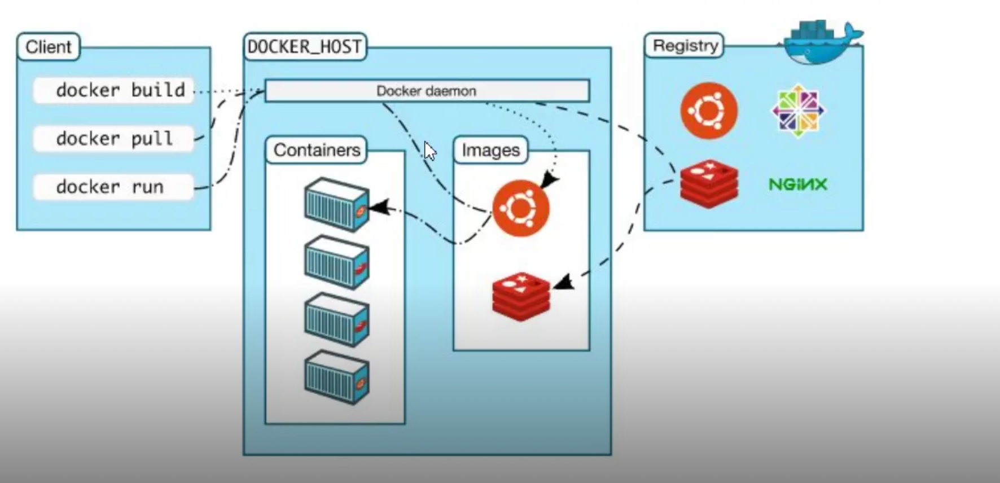

# 介绍

##  软件部署问题
如果想让软件运行的起来要保证操作系统的设置正确。各种库和组件的安装都是正确的。

## 虚拟机
虚拟机就是带环境安装的一种解决方案。它可以再一个操作系统里运行另一个操作系统。如以下缺点：
- 占用资源多
- 冗余步骤多
- 启动速度慢
 
## Linux 容器

- 由于虚拟机存在这些缺点，`Linux`发展出现了另一种虚拟技术：`Linux`容器。
- `Linux`容器不是模式一个完整的操作系统，而是对进程进行隔离。或者说，在正常的进程外面套了一个保护层。对于容器里面的进程来说，它接触的各种资源都是虚拟的，从而实现与操作系统的隔离。
    - 启动快
    - 资源占用小
    - 体积小

## Docker
 - `Docker`属于 `Linux` 容器的一种封装。提供简单易用的容器使用接口。 他是目前最流程`Linux`容器解决方案。
 - `Docker`将应用程序与该程序的依赖，打包在一个文件里。运行这个文件，就会生成一个虚拟容器。程序在这个虚拟容器里运行，就好像在真实的物理机运行一样。

 ## Docker 和 KVM

TODO

## docker应用场景
- 节省项目换将部署时间
  - 单项目打包
  - 整套项目打包
  - 新开源技术
- 环境一致性
- 持续集成
- 微服务
- 弹性伸缩

## Docker体系结构


## Docker安装
- `Docker`分为企业版`(EE)` 和 社区版`(CE)`
- [docker-ce](https://mp.weixin.qq.com/s/s5IhxV2ooX3JN_X416nidA)
- [hub.io](https://www.docker.com/products/docker-hub)

## 安装
## 启动
## 查看Docker的版本
## 卸载

## 阿里云加速
## image镜像

- `Docker`把应用程序及其依赖，打包在 `image`文件里面。只有通过这个文件，才能生成`Docker`容器。
- `image` 可以看作是容器的模板。
- `Docker` 根据`image`文件生成容器的实例。
- 同一个`image`文件，可以生成多个同时运行的容器实例。
- 镜像不是一个一个文件，而是有层的。
- 容器其实就是在镜像的最上面加了一层读写层， 在运行容器里做得任何文件改动，都会写到这个读写层里。如果容器删除了，最上面的读写层也就删除了，改动也就丢失了。
- 我们可以通过`docker history <ID/NAME>` 查看镜像中的各层内容及大小。每层对应着`Dockerfile`中的一条指令。

| 命令     | 含义 |  语法 |     
| :--------- | :-- | --- |  
| ls | 查看全部镜像 | docker image ls |
| search  | 查看镜像历史  | docker search [imageName]  |
| history | 查看镜像历史  | docker history [imageName] |
| inspect | 显示一个或多个镜像的详细信息  | docker inspect [imageName] |
| pull | 拉去镜像  | docker pull [imageName] |
| push | 推动一个镜像到镜像仓库  | docker push [imageName] |
| rmi | 删除镜像  | docker rmi [imageName] |
| prune | 移除未使用的镜像， 没有标记或任何容器引用  | docker image prune |


### docker image ls
```sh
[root@iZm5eeens8iab3xz6f0rfiZ ~]# systemctl start docker.service
[root@iZm5eeens8iab3xz6f0rfiZ ~]# docker image ls 
REPOSITORY          TAG                 IMAGE ID            CREATED             SIZE
node                latest              173eeb895217        9 days ago          943MB
nginx               latest              7e4d58f0e5f3        10 days ago         133MB
hello-world         latest              bf756fb1ae65        8 months ago        13.3kB
```

### 查看镜像
```sh
REPOSITORY          TAG                 IMAGE ID            CREATED             SIZE
[root@iZm5eeens8iab3xz6f0rfiZ ~]# docker search  node
NAME                                   DESCRIPTION                                     STARS               OFFICIAL            AUTOMATED
node                                   Node.js is a JavaScript-based platform for s…   9223                [OK]                
mongo-express                          Web-based MongoDB admin interface, written w…   773                 [OK]                
...
```
### 查找镜像
### 拉去镜像
### 删除镜像

## 容器
- `docker run` 命令会从 `image` 文件， 生成一个正在运行的容器实例。
- `docker container run` 命令具有自动抓取`image`文件的功能。如果发现本地没有指定的`image`文件，就会自动从仓库拉去。
- 输入提示后，`hello world` 就会停止运行，容器自动终止。
- 有些容器不会自动停止。
- `image` 文件生成容器实例，文本也是一个文件，成为容器文件。
- 容器生成，就会同时存在两个文件:`image`文件和容器文件。
- 关闭容器并不会删除容器文件，只是容器停止运行。

### 命令

| 命令     | 含义 |  语法 |     
| :--------- | :-- | --- |  
| run | 从镜像运行一个容器 | docker run hello-world |
| ls  | 列出容器  | docker container  ls |
| inspect  | 显示一个或者多个容器详细信息  | docker inspect |


## compose
- `compose`通过一个配置文件来管理多个`docker` 容器。
- 在配置文件中，所有的容器通过`services`来定义，然后使用`docker-compose`脚本来启动、停止和重启应用和应用中的服务以及所有依赖的服务器。
- 步骤：
   - 最后services，运行 `docker-compose up`, `Compose`将启动并运行整个应用程序配置文件组成。
   - `services` 可以定义需要的服务，每个服务都有自己的名字，使用的镜像，挂载的数据卷所属的网络和依赖的其他服务。
   - `networks` 的应用的网络，在它下面可以自定义使用网络名称，类型。
   - `volumes` 是数据卷，可以在此定义数据卷，然后挂载到不同的服务上面使用。

### 安装`compose`
### 编写`docker-compose.yml`
- 在`docker-compose.yml`中定义组成应用程序的服务，以便他们可以隔离的环境中一起运行。
- 空格缩进代表层次。
- 冒号空格后面有空格。
```yml
version: '2'
services:
    nginx1:
      image: nginx
      port:
         - "8080:80"
    nginx1:
      image: nginx
      port:
         - "8081:80"
```