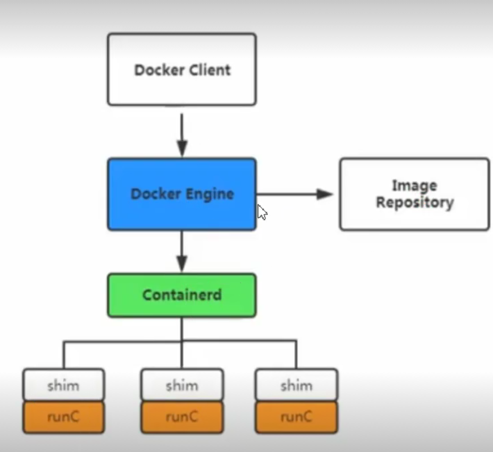

# Dokcer

##  软件部署问题

如果想让软件运行的起来要保证操作系统的设置正确。各种库和组件的安装都是正确的。

## 虚拟机

虚拟机就是带环境安装的一种解决方案。它可以再一个操作系统里运行另一个操作系统。如以下缺点：

* 占用资源多

* 冗余步骤多

* 启动速度慢

 

## Linux 容器

* 由于虚拟机存在这些缺点， `Linux` 发展出现了另一种虚拟技术： `Linux` 容器。
* `Linux` 容器不是模式一个完整的操作系统，而是对进程进行隔离。或者说，在正常的进程外面套了一个保护层。对于容器里面的进程来说，它接触的各种资源都是虚拟的，从而实现与操作系统的隔离。

    - 启动快

    - 资源占用小

    - 体积小

## Docker

 - `Docker` 属于 `Linux` 容器的一种封装。提供简单易用的容器使用接口。 他是目前最流程 `Linux` 容器解决方案。
 - `Docker` 将应用程序与该程序的依赖，打包在一个文件里。运行这个文件，就会生成一个虚拟容器。程序在这个虚拟容器里运行，就好像在真实的物理机运行一样。

 ## Docker 和 KVM

* 启动时间

  + `Docker` 秒级启动。

  + `KVM` 分钟明级别。

* 轻量级

  

  + 容器镜像像普通以 `M` 为单位，虚拟机以 `G` 为单位。容器资源占用小，要比虚拟机要部署更快。

  + 虚拟机需要虚拟化一些设备，具有完善的 `OS` , 具备完整的 `OS` 虚拟机开机开销大， 因而降低性能，没有容器性能好。

* 安全性

  + 由于共享主机内核，只是进程隔离，因为隔离性和稳定性不如虚拟机。容器具有一定权限访问宿主机内核，存在一定安全隐患。

* 使用要求

   - `KVM` 基于硬件的完整虚拟化，需要硬件 `CPU` 虚拟化支持技术。

   -  容器共享宿主主机内核，可运行在主机的 `Linux` 的发行版， 不用考虑 `CPU` 是否支持虚拟化技术。

## docker应用场景

* 节省项目换将部署时间

  + 单项目打包

  + 整套项目打包

  + 新开源技术

* 环境一致性

* 持续集成

* 微服务

* 弹性伸缩

## Docker体系结构

* `containerd` 是一个守护进程，使用 `runc` 管理容器，向 `Docker Engine` 提供接口。

* `shim` 指负责管理一个容器。

* `runC` 是一个轻量级工具，只用来运行容器。



## Docker安装

* `Docker` 分为企业版 `(EE)` 和 社区版 `(CE)`
* [docker](https://www.docker.com/)

* [hub.io](https://www.docker.com/products/docker-hub)

### 安装

[官网安装步骤](https://docs.docker.com/engine/install/centos/)

### 启动

``` sh
$ sudo systemctl start docker
```

### 查看Docker的版本

``` sh
$ docker version
```

### 卸载

[官网卸载步骤](https://docs.docker.com/engine/install/centos/)

## Dokcer架构


## 阿里云加速

## image镜像

* `Docker` 把应用程序及其依赖，打包在 `image` 文件里面。只有通过这个文件，才能生成 `Docker` 容器。

* `image` 可以看作是容器的模板。

* `Docker` 根据 `image` 文件生成容器的实例。

* 同一个 `image` 文件，可以生成多个同时运行的容器实例。

* 镜像不是一个一个文件，而是有层的。

* 容器其实就是在镜像的最上面加了一层读写层， 在运行容器里做得任何文件改动，都会写到这个读写层里。如果容器删除了，最上面的读写层也就删除了，改动也就丢失了。

* 我们可以通过 `docker history <ID/NAME>` 查看镜像中的各层内容及大小。每层对应着 `Dockerfile` 中的一条指令。

| 命令     | 含义 |  语法 |     
| :--------- | :-- | --- |  
| ls | 查看全部镜像 | docker image ls |
| search  | 查看镜像历史  | docker search [imageName]  |
| history | 查看镜像历史  | docker history [imageName] |
| inspect | 显示一个或多个镜像的详细信息  | docker inspect [imageName] |
| pull | 拉去镜像  | docker pull [imageName] |
| push | 推动一个镜像到镜像仓库  | docker push [imageName] |
| rmi | 删除镜像  | docker rmi [imageName] |
| prune | 移除未使用的镜像， 没有标记或任何容器引用  | docker image prune |
| tag | 标记本地镜像, 将其归入某一个仓库  | docker image tag [imageName][username]/[repository]:[tag]|
| export | 导出容器文件系统 `tar` 归档文件创建镜像 | docker export -o mysqlv1.tar a404c6c174a2|
| import | 导入容器快照文件系统 `tar` 归档文件创建镜像 | docker import -o mysqlv1.tar qianduan/mysql:v2|
| save | 保存一个或多个镜像到一个 `tar` 归档文件 | docker save -o  mysqlv2.tar qianduan/mysqlv2:v3|
| load | 加载镜像存储文件来自 `tar` 归档或者标准输入 | docker load -i mysqlv2:tar |
| build | 根据 `docker` 构建镜像|  |

::: warning
用户既可以使用 `docker load` 来带入镜像存储文件到本地镜像库，也可以使用 `docker import` 来导入一个容器快照到本地镜像仓库。
这两者的区别在于容器快照文件将丢弃所有的历史记录和元数据信息（即仅保存容器当时的快照状态）， 而镜像存储文件将保存完整的记录，
体积也大，此外，从容器快照文件导入时可以重新指定标签等元数据信息。
:::

### docker image ls

``` sh
[root@iZm5eeens8iab3xz6f0rfiZ ~]# systemctl start docker.service
[root@iZm5eeenbs8iab3xz6f0rfiZ ~]# docker image ls 
REPOSITORY          TAG                 IMAGE ID            CREATED             SIZE
node                latest              173eeb895217        9 days ago          943MB
nginx               latest              7e4d58f0e5f3        10 days ago         133MB
hello-world         latest              bf756fb1ae65        8 months ago        13.3kB
```

|字段|含义|
|---|---|
|REPOSITORY |仓库地址|
|TAG        |标签|
| IMAGE ID  |镜像ID|
| CREATED   |创建时间|
| SIZE      |镜像大小|

### 查看镜像

``` sh
REPOSITORY          TAG                 IMAGE ID            CREATED             SIZE
[root@iZm5eeens8iab3xz6f0rfiZ ~]# docker search  node
NAME                                   DESCRIPTION                                     STARS               OFFICIAL            AUTOMATED
node                                   Node.js is a JavaScript-based platform for s…   9223                [OK]                
mongo-express                          Web-based MongoDB admin interface, written w…   773                 [OK]                
...
```

|字段|含义|
|---|---|
|NAME        |名称|
|DESCRIPTION |描述|
|STARS       |星星数|
| OFFICIAL   |是否是官方源|

### 拉取镜像

``` sh
[root@iZ2ze4re2plzzckpd3iu6pZ ~]# docker image  pull ubuntu
Using default tag: latest
latest: Pulling from library/ubuntu
a95689b8e6cb: Download complete 
1a0022e444c2: Download complete 
32b7488a3833: Download complete 
Digest: sha256:bc2f7250f69267c9c6b66d7b6a81a54d3878bb85f1ebb5f951c896d13e6ba537
Status: Downloaded newer image for ubuntu:latest
docker.io/library/ubuntu:latest
```

* `docker image pull` 是抓取 `image` 文件的命令。

* `docker.io/hello-world` 是 `image` 文件在仓库里面的位置，其中 `docker.io` 是 `image` 的作者， `hello-world` 是 `image` 文件的名字。

* `Docker` 官方提供的 `image` 文件，都放在 `docker.io` 组里面，所以他是默认组，可以省略 `docker image pull hello-world`

### 查看镜像的详细信息

``` sh
[root@iZ2ze4re2plzzckpd3iu6pZ ~]# docker image inspect ubuntu
[
    {
        "Id": "sha256:9140108b62dc87d9b278bb0d4fd6a3e44c2959646eb966b86531306faa81b09b",
        "RepoTags": [
            "ubuntu:latest"
        ],
        "RepoDigests": [
            "ubuntu@sha256:bc2f7250f69267c9c6b66d7b6a81a54d3878bb85f1ebb5f951c896d13e6ba537"
        ],
        "Parent": "",
        "Comment": "",
        "Created": "2020-09-25T22:34:30.295807036Z",
        "Container": "1046a5d685aef5c37d1829040ca8083b94e4c069ca4963f4b16a6ade2e077b06",
        "ContainerConfig": {
            "Hostname": "1046a5d685ae",
            "Domainname": "",
            "User": "",
            "AttachStdin": false,
            "AttachStdout": false,
            "AttachStderr": false,
            "Tty": false,
            "OpenStdin": false,
            "StdinOnce": false,
            "Env": [
                "PATH=/usr/local/sbin:/usr/local/bin:/usr/sbin:/usr/bin:/sbin:/bin"
            ],
            "Cmd": [
                "/bin/sh",
                "-c",
                "#(nop) ",
                "CMD [\"/bin/bash\"]"
            ],
            "ArgsEscaped": true,
            "Image": "sha256:4ff2090064e7e38688bce713d50f3202d227b3c89fecea1434271c912ccd47e0",
            "Volumes": null,
            "WorkingDir": "",
            "Entrypoint": null,
            "OnBuild": null,
            "Labels": {}
        },
        "DockerVersion": "18.09.7",
        "Author": "",
        "Config": {
            "Hostname": "",
            "Domainname": "",
            "User": "",
            "AttachStdin": false,
            "AttachStdout": false,
            "AttachStderr": false,
            "Tty": false,
            "OpenStdin": false,
            "StdinOnce": false,
            "Env": [
                "PATH=/usr/local/sbin:/usr/local/bin:/usr/sbin:/usr/bin:/sbin:/bin"
            ],
            "Cmd": [
                "/bin/bash"
            ],
            "ArgsEscaped": true,
            "Image": "sha256:4ff2090064e7e38688bce713d50f3202d227b3c89fecea1434271c912ccd47e0",
            "Volumes": null,
            "WorkingDir": "",
            "Entrypoint": null,
            "OnBuild": null,
            "Labels": null
        },
        "Architecture": "amd64",
        "Os": "linux",
        "Size": 72875723,
        "VirtualSize": 72875723,
        "GraphDriver": {
            "Data": {
                "LowerDir": "/var/lib/docker/overlay2/4c837e528b1c7846646a1654de43cc22ab3ea6e8a520f5e55748666703273208/diff:/var/lib/docker/overlay2/8c280d4fed0d7ab2674855083d0de12cb9cb4c00bc075bb0ff6a34d7158c2559/diff",
                "MergedDir": "/var/lib/docker/overlay2/a86ce81b59de68c37663108a0a549a59215e3d5c6d6173fb0dead7f469accaa5/merged",
                "UpperDir": "/var/lib/docker/overlay2/a86ce81b59de68c37663108a0a549a59215e3d5c6d6173fb0dead7f469accaa5/diff",
                "WorkDir": "/var/lib/docker/overlay2/a86ce81b59de68c37663108a0a549a59215e3d5c6d6173fb0dead7f469accaa5/work"
            },
            "Name": "overlay2"
        },
        "RootFS": {
            "Type": "layers",
            "Layers": [
                "sha256:d42a4fdf4b2ae8662ff2ca1b695eae571c652a62973c1beb81a296a4f4263d92",
                "sha256:90ac32a0d9ab11e7745283f3051e990054616d631812ac63e324c1a36d2677f5",
                "sha256:782f5f011ddaf2a0bfd38cc2ccabd634095d6e35c8034302d788423f486bb177"
            ]
        },
        "Metadata": {
            "LastTagTime": "0001-01-01T00:00:00Z"
        }
    }
]
```

### 删除镜像

``` sh
docker rmi hello-world
```

## 容器

* `docker run` 命令会从 `image` 文件， 生成一个正在运行的容器实例。

* `docker container run` 命令具有自动抓取 `image` 文件的功能。如果发现本地没有指定的 `image` 文件，就会自动从仓库拉去。

* 输入提示后， `hello world` 就会停止运行，容器自动终止。

* 有些容器不会自动停止。

* `image` 文件生成容器实例，文本也是一个文件，成为容器文件。

* 容器生成，就会同时存在两个文件: `image` 文件和容器文件。

* 关闭容器并不会删除容器文件，只是容器停止运行。

### 命令

| 命令     | 含义 |  语法 |     
| :--------- | :-- | --- |  
| run | 从镜像运行一个容器 | docker run hello-world |
| ls  | 列出容器  | docker container  ls |
| inspect  | 显示一个或者多个容器详细信息  | docker inspect |
| attach  | 要attach上去的容器必须正在运行，可以同时连接上同一个 `container` 来共享屏幕 | docker attach |
| stats  | 显示容器资源使用统计 | docker container stats |
| top  | 显示一个容器运行的进程 | docker container top |
| update  | 显示一个容器运行的进程 | docker container update |
| port  | 更新一个或多个容器配置 | docker container port |
| ps  | 查看当前运行的容器 | docker ps -a -l |
| kill [containerId]  | 终止容器（发送SIGKILL） | docker kill [containerId] |
| rm [containerId]  | 删除容器 | docker rm [containerId] |
| start [containerId]  | 启动已经生成、已经停止运行的容器文件 | docker start [containerId] |
| stop [containerId]  | 终止容器运行（发送 SIGTERM） | docker stop [containerId] |
| logs [containerId]  | 查看 `docker` 容器的输出 | docker logs [containerId] |
| exec [containerId]  | 进入一个正在运行的 `docker` 容器执行命令 | docker container  exec  -it [containerId] /bin/bash|
| cp [containerId]  | 从正在运行的 `Dokcer` 容器里，将文件拷贝到本地 | docker container  cp -it [containerId]:app/package.josn|
| commit [containerId]  | 创建一个新镜像来自容器 | docker container  commit -a “qianduan” -m “mysql” 5da48d5a1349　mynginx:v1|

### 启动容器

``` sh
docker run ubuntu /bin/echo "Hello world"
```

* `docker: Docker` 的二进制执行文件。

* `run:` 与前面的 `docker` 组合起来运行一个容器。

* `ubuntu` 指定要运行的镜像， `Docker` 首先从本地主机上查找镜像是否存在，如果不存在， `Docker` 就会从镜像仓库 `Docker hub` 下载公共镜像。

* `/bin/echo Hello world` 在容器里执行的命令。

|参数|含义|
|---|---|
|-i --interactive      |交互式|
|-t --tty              |分配一个伪终端|
|-d --detach           |运行容器到后台|
|-a --attch list       |附加到运行的容器|
|-e --env list         |设置环境变量|
|-p --public list      |发布容器到主机|
|-P                    |--public-all |
|--mount   mount       |挂载宿主机分区到容器|
|-v  --volumn  list    |挂载宿主机分区到容器|

### 查看容器

``` sh
[root@iZ2ze4re2plzzckpd3iu6pZ ~]# docker container ps -al
CONTAINER ID        IMAGE               COMMAND             CREATED             STATUS                    PORTS               NAMES
5da48d5a1349        hello-world         "/hello"            46 hours ago        Exited (0) 46 hours ago                       elastic_allen
```

* `-a` 显示所有的容器，包括已停止的。

* `-l` 显示最新的那个容器。

|字段|含义|
|--|---|
|CONRAINER ID|容器ID|
|IAMGE       |使用的镜像|
|COMMAND     |使用的命令|
|CREATED     |创建时间|
|STATUS      |状态|
|PORTS       |端口号|
|NAMES       |自动分配的名称|

### 后台运行容器

``` sh
root@iZ2ze4re2plzzckpd3iu6pZ ~]# docker run -d -p 8080:80 nginx
```

### kill

``` sh
docker stop　5da48d5a1349　   # 给容器发送结束信号
docker kill　5da48d5a1349　　　# 直接停止 ，不发请求
```

### 删除容器

``` sh
root@iZ2ze4re2plzzckpd3iu6pZ ~]# docker container rm 5da48d5a1349  # 删除指定id容器
root@iZ2ze4re2plzzckpd3iu6pZ ~]# docker container rm $( docker ps -a -q )  # 删除所有的容器

```

### 创建一个新的镜像

* 创建一个新镜像来自容器。

``` sh
[root@iZ2ze4re2plzzckpd3iu6pZ ~]# docker container ls -al
CONTAINER ID        IMAGE               COMMAND             CREATED             STATUS                      PORTS               NAMES
3bea777f1408        9140108b62dc        "/bin/bash"         18 seconds ago      Exited (0) 18 seconds ago                       jovial_kepler
# -a 指定作者
# -m 指定注释
# myubuntu:v1  myubuntu 镜像的名字 v1指定镜像的tag
[root@iZ2ze4re2plzzckpd3iu6pZ ~]# docker commit -a "wo" -m "dierban" 3bea777f1408 myubuntu:v1
sha256:39605eb3b48d5c5defd5aa484070e14b9e99706b5dd1078ce4e3ca0a9d9fb821
[root@iZ2ze4re2plzzckpd3iu6pZ ~]# docker image ls
REPOSITORY          TAG                 IMAGE ID            CREATED              SIZE
myubuntu            v1                  39605eb3b48d        3 seconds ago        72.9MB
ubuntu              latest              9140108b62dc        2 weeks ago          72.9MB
hello-world         latest              bf756fb1ae65        9 months ago         13.3kB
```

## compose

* `compose` 通过一个配置文件来管理多个 `docker` 容器。
* 在配置文件中，所有的容器通过 `services` 来定义，然后使用 `docker-compose` 脚本来启动、停止和重启应用和应用中的服务以及所有依赖的服务器。
* 步骤：

   - 最后services，运行 `docker-compose up` , `Compose` 将启动并运行整个应用程序配置文件组成。
   - `services` 可以定义需要的服务，每个服务都有自己的名字，使用的镜像，挂载的数据卷所属的网络和依赖的其他服务。
   - `networks` 的应用的网络，在它下面可以自定义使用网络名称，类型。
   - `volumes` 是数据卷，可以在此定义数据卷，然后挂载到不同的服务上面使用。

### 安装 `compose`

### 编写 `docker-compose.yml`
* 在 `docker-compose.yml` 中定义组成应用程序的服务，以便他们可以隔离的环境中一起运行。
* 空格缩进代表层次。
* 冒号空格后面有空格。

``` yml
version: '2'
services:
    nginx1:
      image: nginx
      port:
         - "8080:80"
    nginx1:
      image: nginx
      port:
         - "8081:80"
```
