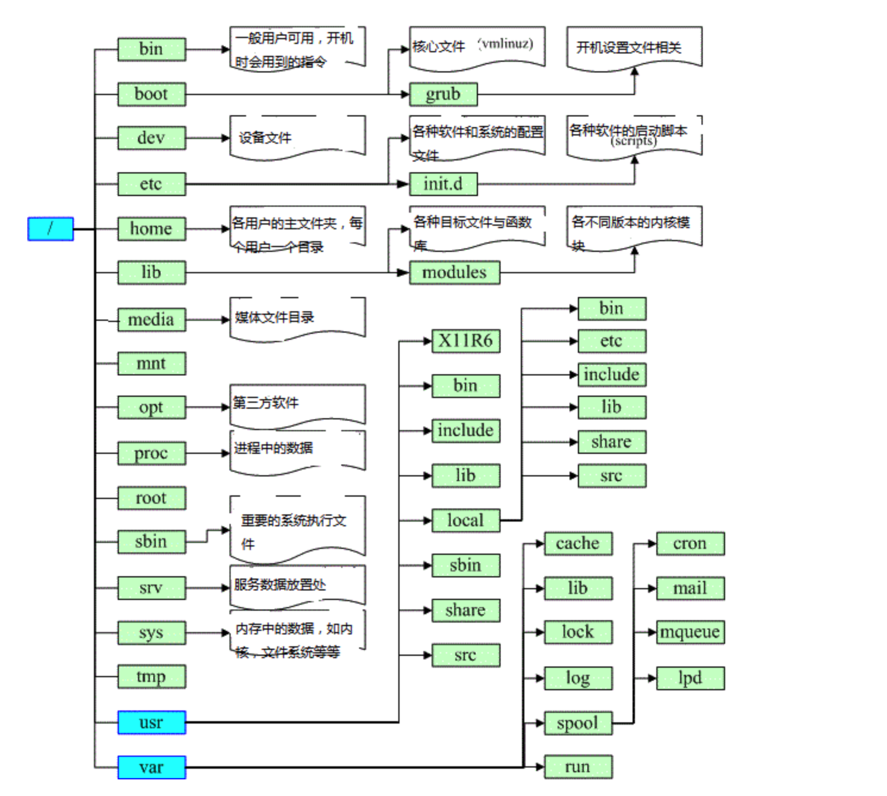

# Linux 目录结构

查看 `linux` 的目录结构如下：
```bash{1}
[root@iZm5eeens8iab3xz6f0rfiZ /]# cd / && ls -al
total 68
dr-xr-xr-x. 18 root root  4096 Sep 12 22:10 .
dr-xr-xr-x. 18 root root  4096 Sep 12 22:10 ..
lrwxrwxrwx.  1 root root     7 Jul 11  2019 bin -> usr/bin
dr-xr-xr-x.  5 root root  4096 Jul 11  2019 boot
drwxr-xr-x  19 root root  2980 Sep 14 10:24 dev
drwxr-xr-x. 80 root root  4096 Sep 13 10:04 etc
drwxr-xr-x.  2 root root  4096 Apr 11  2018 home
lrwxrwxrwx.  1 root root     7 Jul 11  2019 lib -> usr/lib
lrwxrwxrwx.  1 root root     9 Jul 11  2019 lib64 -> usr/lib64
drwx------.  2 root root 16384 Jul 11  2019 lost+found
drwxr-xr-x.  2 root root  4096 Apr 11  2018 media
drwxr-xr-x.  2 root root  4096 Apr 11  2018 mnt
drwxr-xr-x.  3 root root  4096 Sep 13 10:04 opt
dr-xr-xr-x  81 root root     0 Sep 14 10:20 proc
dr-xr-x---. 11 root root  4096 Sep 14 23:41 root
drwxr-xr-x  23 root root   660 Sep 14 10:29 run
lrwxrwxrwx.  1 root root     8 Jul 11  2019 sbin -> usr/sbin
drwxr-xr-x.  2 root root  4096 Apr 11  2018 srv
dr-xr-xr-x  13 root root     0 Sep 14 18:20 sys
drwxrwxrwt. 10 root root  4096 Sep 15 03:11 tmp
drwxr-xr-x. 13 root root  4096 Jul 11  2019 usr
```
说明

| 路径     | 说明 |         
| :--------- | :-- | 
| /   |  根目录  |     
| /boot   |  启动目录, 启动相关文件 |   
| /dev |   设备文件 | 
| /etc |   配置文件 | 
| /home |   普通用户的家目录 | 
| /lib |   系统库的保存目录 | 
| /mnt |   移动设备的挂在目录 | 
| /media|  光盘的挂载目录  | 
| /misc|  磁带机的挂载目录  | 
| /root|  超级用户的家目录， 可以操作  | 
| /temp|  临时目录， 可以操作  | 
| /proc|  正在运行的内核信息的映射，主要输出进程的信息、内存资源信息和磁盘的分区的信等等| 
| /sys |  硬件设置的驱动程序的信息  | 
| /var|  变量  | 
| /bin |  普通的基本命令， 如ls，chmod等。一般的用户也可以使用| 
| /sbin |   基本的系统命令，如shutdown、reboot。用于系统启动，系统修复。只有管理员才可以使用 | 
| /usr/bin| 是后期安装的一些软件的运行脚本   | 
| /usr/sbin|   置一些用户安装的系统管理的必备程序 | 



