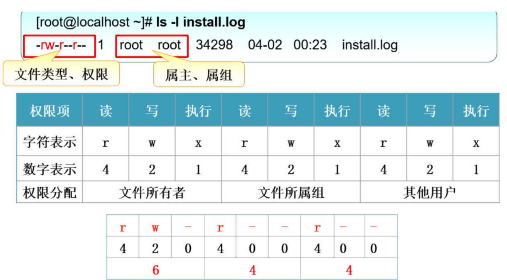

# 文件权限

## 文件的权限

 `dr-xr-xr-x.`
* 文件的类型

  + `-` 文件

  + `d` 目录

  + `l` 软链接文件

* 所有者，所有组，其他人。

* `r` 读, `w` 写, `x` 执行。




## 基本权限的修改

 ```sh
[root@iZm5eeens8iab3xz6f0rfiZ /]# chmod [选项] 模式 文件名
 ```
- 选项

   - `-R` 递归

- 模式 

   - `[ugoa][+-=][rwx]`

      -  `u (user)` 文件所有者。

      -  `g (group)`文件所有者所在组。

      -  `o (others)`所有其他用户。

      -  `a (all)`  所用用户, 相当于 `ugo`。

      -  `+` 为指定的用户类型增加权限。

      -  `-` 去除指定用户类型的权限。

      -  `=` 设置指定用户权限的设置，即将用户类型的所有权限重新设置。

- 权限数字

   - r 4

   - w 4

   - x 4
  
## 权限的作用

- 对文件来说最高的权限是`x`。

- 对目录来说最高权限是`w`，只有读的权限没有意思，对目录有了写的权限，可以做任何事情。


## 其他权限命令

### chown

- `chmod` 用户名 文件名。

-  如果想让一个用户拥有`7`的权限，可以把这个文件的所有者改为这个用户名。

```sh
chmod 755 folder
chown zf1 folder
```
#### chgrp

- `chgrp` 组名 文件名。

-  创建用户的时候为他创建一个所属组。

```sh
chgrp zf1 folder
chown root:root folder
```

