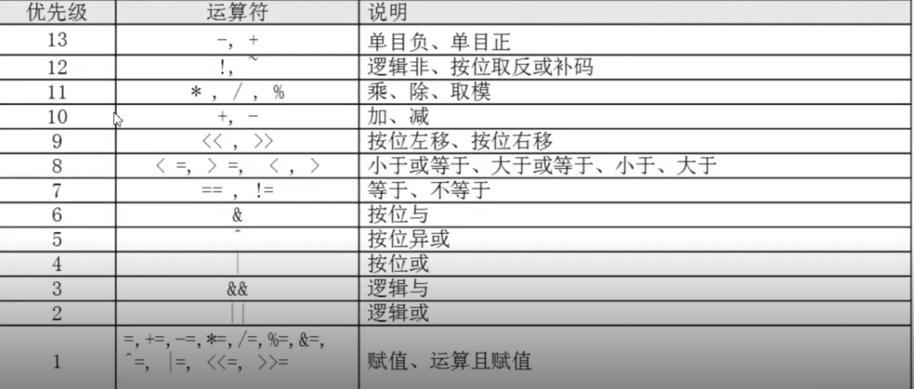

# 运算符

- 弱类型并且默认是字符串类型。


## declare命令

- 用来声明变量类型。
```sh
declare [+-] [选项] 变量名
```
|  选项 | 含义 | 
| --------- | --- |  
| +     |  给变量设置类型 |  
| -     |  取消变量的类型属性 |  
| -a    |  将变量声明为数组的类型 |  
| -i    |  将变量声明为整数型（integer） |   
| -x    |  将变量声明为环境变量 |   
| -r    |  将变量声明为只读类型 |   
| -p    |  显示指定变量的被声明的类型|   

```sh
# 声明成整形
root@iZm5eeens8iab3xz6f0rfiZ ~]# a=1
[root@iZm5eeens8iab3xz6f0rfiZ ~]# b=2
[root@iZm5eeens8iab3xz6f0rfiZ ~]# c=$a+$b
[root@iZm5eeens8iab3xz6f0rfiZ ~]# echo $c
1+2
[root@iZm5eeens8iab3xz6f0rfiZ ~]# declare -i c=$a+$b
[root@iZm5eeens8iab3xz6f0rfiZ ~]# echo $c
3

# 声明环境变零
[root@iZm5eeens8iab3xz6f0rfiZ ~]# declare -x kk=1
[root@iZm5eeens8iab3xz6f0rfiZ ~]# bash
[root@iZm5eeens8iab3xz6f0rfiZ ~]# set | grep kk
kk=1
```

## 数组
```sh
root@iZm5eeens8iab3xz6f0rfiZ ~]# name[0]=zhangsan
[root@iZm5eeens8iab3xz6f0rfiZ ~]# name[1]=lisi
[root@iZm5eeens8iab3xz6f0rfiZ ~]# declare -a names
[root@iZm5eeens8iab3xz6f0rfiZ ~]# echo ${name}
zhangsan
[root@iZm5eeens8iab3xz6f0rfiZ ~]# echo ${name[1]}
lisi
[root@iZm5eeens8iab3xz6f0rfiZ ~]# echo ${name[*]}
zhangsan lisi
```

## 声明环境变量

- `export` 最终执行的是`declare -x`命令。

- `declare -p` 可以查看所有的类型。

```sh
# 两者的操作是等价的
root@iZm5eeens8iab3xz6f0rfiZ ~]# export NAME=qiandun
[root@iZm5eeens8iab3xz6f0rfiZ ~]# declare -x NAME=qianduan
```

## 只读属性
```sh
[root@iZm5eeens8iab3xz6f0rfiZ ~]# declare  -r aa=qianduan
[root@iZm5eeens8iab3xz6f0rfiZ ~]# aa=houduan
bash: aa: readonly variable
```

## 查询变量属性
- `declare -p` 查询所有的变量属性。

- `declare -p 变量名` 查询指定变量的属性。

## 数值运算的方法

- 主要用`declare`声明变量的时候指定类型就可以进行数值运算。

### expr或let

```sh
# +号左右必须有空格
[root@iZm5eeens8iab3xz6f0rfiZ ~]# num1=1
[root@iZm5eeens8iab3xz6f0rfiZ ~]# num2=3
[root@iZm5eeens8iab3xz6f0rfiZ ~]# s=$(expr $num1 + $num2)
[root@iZm5eeens8iab3xz6f0rfiZ ~]# echo $s
4
```

```sh
# 使用双括号
[root@iZm5eeens8iab3xz6f0rfiZ ~]# s=$((num1+$num2))
[root@iZm5eeens8iab3xz6f0rfiZ ~]# echo s
s

# 使用[ ]
[root@iZm5eeens8iab3xz6f0rfiZ ~]# s=[num1+$num2]
[root@iZm5eeens8iab3xz6f0rfiZ ~]# echo s
s

[root@iZm5eeens8iab3xz6f0rfiZ ~]# d=$(date)
[root@iZm5eeens8iab3xz6f0rfiZ ~]# echo $d
Fri Oct 2 19:45:41 CST 2020
```

## 优先级



## cut

- `cut`用来提取文本中的某一个部分文件。

```sh
cut [选项] 文件名
```
常用选项

  - `-f` 列号，用来指定要提取的列。

  - `-d` 分隔符，按照指定分隔符分格列， 默认是按照``TAB`制表符。

```sh
[root@iZm5eeens8iab3xz6f0rfiZ ~]# cat /etc/passwd | grep /bin/bash | cut -f 1,2 -d :

[root@iZm5eeens8iab3xz6f0rfiZ ~]# df -h | grep /dev/sda5 | cut -f 5
```

## prinf

- 按规定的格式输出。

- `prinf` 输出类型，输出内容。

|  参数 | 含义 | 
| --------- | --- |  
| %ns     |  输出字符串，`n`是数字指代输出几个字符。 |  
| %ni     |  输出整数，`n`是指输出几个数字。 |  
| %m.nf   |  输出浮点数，`m`和`n`是数字，指代输出的整数位数和小数位数，如%6.2代表输出6位位，2位小数，4位整数。 |  


## awk

- `awk 条件1{动作1} 条件2{动作2}...` 文件名

- 条件(Pattern)

   - 一般使用关系表达式最为条件。

   - `x > 10` 判断变量`x`是否大于`10`。

   - `x >= 10`大于等于。

   - `x <= 10`小于等于。

- 动作(Action)

   - 格式化输出。

- `$0` 整行 `$1` 第一列
```sh
[root@iZm5eeens8iab3xz6f0rfiZ ~]# df -h | grep /dev/sda5 | awk `{print $5}` | cut -d '%' -f 1
```

### begin  end

- `awk`可以正确截取制表符和空格。

- `begin` 在所有输出之前打印。

- `end` 在所有输出以后打印。

```sh
[root@iZm5eeens8iab3xz6f0rfiZ ~]# awk 'BEGIN{print "开始"} END{print ”结束“}' numbers.txt
```

### FS 

- `Field Separator` 字段分隔符。

```sh
[root@iZm5eeens8iab3xz6f0rfiZ ~]# awk 'BEGIN{FS=":"}{print $1 "\t" $2}' /etc/passwd
```

### 声明变量
```sh
awk 'BEGIN{sum=0}{sum=sum+$1}END{print sum}' numbers.txt
```
### 多条件

```sh
awk '$2>90{print $1 "\t优秀"}$2>80{print $2 "\t良好"}' socre.txt
```

### NR

- NR, 表示`awk`开始执行过程后程序所读到的数据行数。

```sh
awk '{print NR,$0}' file1
awk 'NR=3{print $0}' file1
```

### OFS

- OFS Out of Field Separator , 输出字段分隔符。

```sh
[root@iZm5eeens8iab3xz6f0rfiZ ~]# echo "i love you" |  awk 'BEGIN{ FS=" ";OFS="-"}{print $1,$2,$3}'
i-love-you
```

## sed命令

- `sed`是一个轻量级编辑器，主要用来对数据进行选取、替换、和新增操作。

- `sed [选项] [动作] 文件名`。

- 所有的动作都是必须使用单引号括起来。

- 类型类似于批量`vi`操作。

选项

| <div style="width:50px">参数</div>| 含义| 示例 | 
| ---------------- | --- | --- |
|-n | 一般sed命令会把所有的数据都输出到屏幕上，如果加入此选项则只会处理过的行输出到屏幕上。|  `sed -n 2p sorce.txt` |
|-e | 允许对输入数据应用多条`sed`编辑命令。 |  sed -e 's/75/70/g;s/55/50/g' sorce.txt|
|-i | 用`sed`的修改直接修改编辑的文件，而不是在屏幕上输出。 |  `sed -i '1i newline' sorce.txt`|

动作

| <div style="width:50px">参数</div>| 含义| 示例 | 
| ---------------- | --- | --- |
| a | 追加，在每一行或者指定行下面添加一行或多行 。|  `sed -i '1a newline' sorce.txt` |
| c | 行替换，用`c`后面的字符串替换掉原始整个数据行。 |  `sed  'c newline' sorce.txt`|
| s | 字符串替换，用一个字符串替换另一个字符串，格式为`行范围s/旧字符串/新字符串/g` |  `sed  '3s/lisi/lisisi/g' sorce.txt`|
| d | 删除指定的行|  `sed  '1，2d' sorce.txt`|
| p | 打印，输出指定的行 |  `sed -n '2p' sorce.txt`|


## 排序命令sort

- sort [选项] 文件名

选项

| 选项 | 含义|  示例 |
| ---------------- | --- | ---- |
| -f | 忽略大小写。| sort -f -t ":" -n -k 5,5 /etc/passwd |
| -n | 以数值型进行排序，默认使用字符串。 | sort -t ":" -n -k 3,3 /etc/passwd |
| -r | 反向排序，默认从小到大。 | sort -r /etc/passwd |
| -t | 指定分隔符，默认分隔符都是制表符。|  sort -t ":" -k 3,3 /etc/passwd |
| -k n[,m]| 按照指定的字段范围排序。 从第`n`个字段开始，到第`m`个字段结束，默认是到行尾。 | sort -t ":" -k 3,3 /etc/passwd  |

```sh
sort /etc/passed
sort -r /etc/passwd
sort -t ":" -k 3,3 /etc/passwd
```