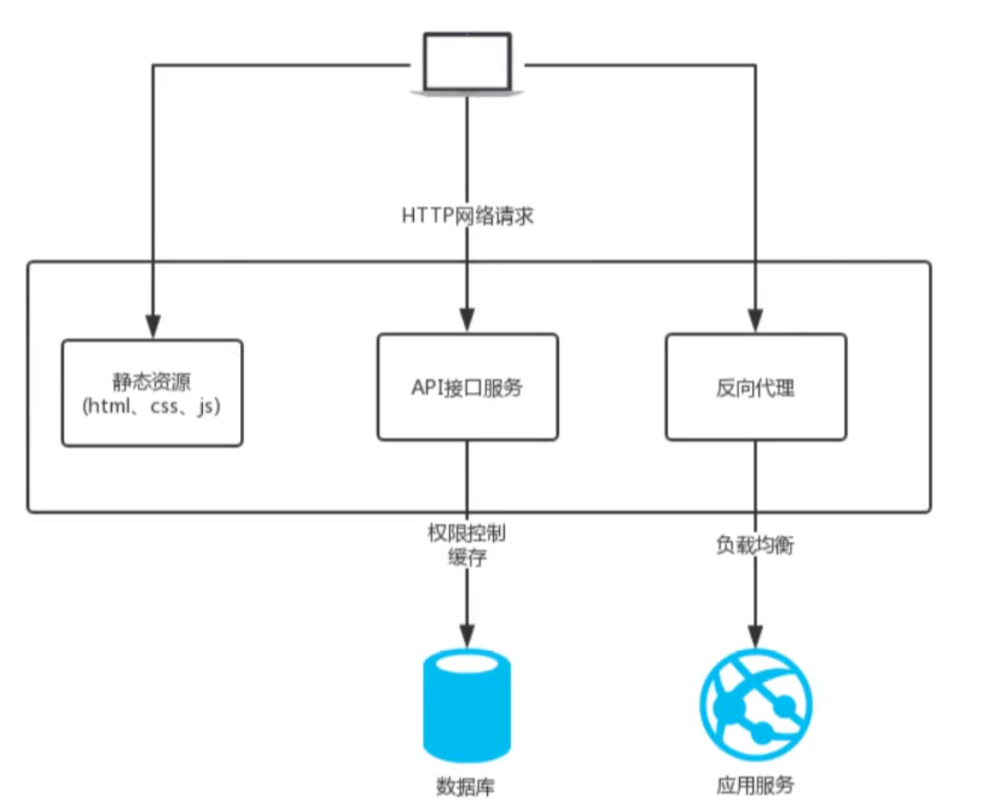
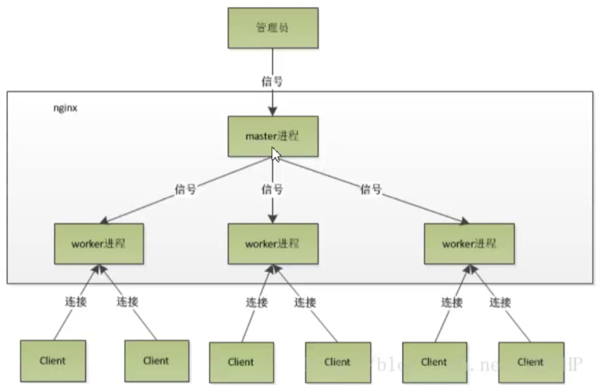
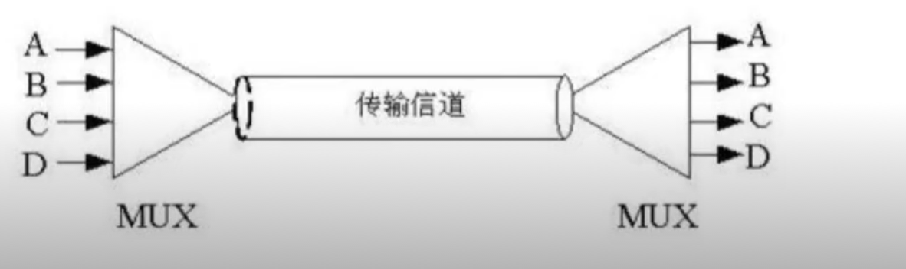

# Nginx

## Nginx 应用场景

- 静态资源服务器

- 反向代理

- `API`接口服务

## Nginx优势

- 高并发高性能。

- 可扩展性好。

- 高可靠性。

- 热部署。

- 开源许可证。

## Nginx的架构

### 轻量

- 源代码只包含核心模块。

- 其他非核心模块都是通过模块来实现， 可以自由选择。

### 架构

- `Nginx`采用的多进程（单线程） 和 多路 IO 复用模型。

### 工作流程

1. Nginx 在启动后，会有一个 `master` 进程和多个独立的`worker` 进程。

2. 接受到来自外界额信号，向 `worker` 进程会发送信号，每个进程都有可能来处理这个链接。

3. `master` 进程能够监控 `worker` 进程的运行的状态，当`worker`进程退出后（异常情况下）， 会自动启动新的`worker`进程。

- `worker` 进程数， 一般会设置成机器`cpu`核数，因为更多的`worker`数， 会导致进程的相互竞争`cpu` 资源， 避免不必要的上下文切换。

- 使用多进程模式， 不仅能提高并发率， 而且进程之间相互独立， 一个`worker`不会影响其他`worker`进程。

### IO 多路复用
- 多个文件描述符的`IO`操作都能在一个线程里并发交替顺序完成， 复用线程。

### CPU亲和
- 把`CPU` 内核和 `Nginx` 的工作进程绑定在一起，让每个`worker`进程固定在一个`CPU`上执行，从而减少`CPU`的切换并提高缓存命中率， 提高性能。

### sendFile

- 零拷贝传输模式。

