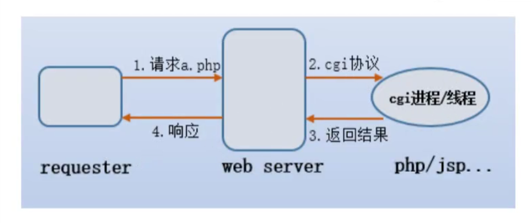

# 安装

## 参考文档

* [中文文档](https://www.nginx.cn/doc/index.html)
* [官方英文文档](http://nginx.org/en/docs/)

## 版本分类

*  [Mainline version 开发版](http://nginx.org/en/download.html)

*  [Stable version 稳定版](http://nginx.org/en/download.html)

*  [Legacy versions 历史版本](http://nginx.org/en/download.html)

``` sh
yum -y install  gcc gcc-c++ wget
yum -y install  autoconf  pcre  pcre-devel make  automake httpd-tools 
```

|  软件包   | 说明  |
|  ----  | ----  |
| gcc  | `gcc` 是指整个 `gcc` 的这一套工具集合，它分为 `gcc` 前端和 `gcc` 后端（我个人理解为 `gcc` 外壳和 `gcc` 引擎）， `gcc` 前端对应各种特定的语言（如 `c++/go` 等）的处理（对 `c++/go` 等特定的语言进行对应的语法检查，将 `c++/go` 等语言的代码转换为 `c` 的代码等），gcc后端对应把前端的 `c` 代码转为跟你的电脑硬件相关的汇编或机器码。|
| gcc-c++  | 而就软件程序包而言， `gcc.rpm` 就是那个 `gcc` 的后端，而 `gcc-c++.rpm` , 就是针对 `c++` 这个特定的语言的 `gcc` 前端。|
| wget | 用来从网络上下载文件。|
| autoconf  | `autoconf` 是一个软件包，以适应多种 `Unix` 类系统的 `Shell` 脚本工具。 |
| pcre  | `PREC` (Perl compatible Regular Expressions) 是一个 `，Perl` 库， 包括 `Perl` 兼容的正则表达式库。 |
| pcre-devel  | devel 包主要是提供开发用，包括头文件和链接库。 |
| make  | 常指一条计算机指令， 是在安装有 `GNU Make` 的计算机上可以执行指令， 该指令是读入一个名为 `makefile` 的文件，然后执行这个文件中的指定的指令。|
| automake  | automake可以用来帮助我们自动生成符合自由软件管理的 `Makefiles` |
| wget  | `wget` 是从网络上下自动下载的文件的自由工具，支持 `HTTP` 、 `HTTPS` 、 `FTP` 三个最常用的 `Tcp/Ip` 协议下载，并可以使用 `HTTP` 代理。|
| httpd-tools  | apace压力测试 |

## 目录

###  查看安装目录

``` sh
[root@iZm5eeens8iab3xz6f0rfiZ ~]# rpm -ql nginx
/etc/logrotate.d/nginx
/etc/nginx
/etc/nginx/conf.d
/etc/nginx/conf.d/default.conf
/etc/nginx/fastcgi_params
/etc/nginx/koi-utf
/etc/nginx/koi-win
/etc/nginx/mime.types
/etc/nginx/modules
/etc/nginx/nginx.conf
/etc/nginx/scgi_params
/etc/nginx/uwsgi_params
/etc/nginx/win-utf
/etc/sysconfig/nginx
/etc/sysconfig/nginx-debug
/usr/lib/systemd/system/nginx-debug.service
/usr/lib/systemd/system/nginx.service
/usr/lib64/nginx
/usr/lib64/nginx/modules
/usr/libexec/initscripts/legacy-actions/nginx
/usr/libexec/initscripts/legacy-actions/nginx/check-reload
/usr/libexec/initscripts/legacy-actions/nginx/upgrade
/usr/sbin/nginx
/usr/sbin/nginx-debug
/usr/share/doc/nginx-1.18.0
/usr/share/doc/nginx-1.18.0/COPYRIGHT
/usr/share/man/man8/nginx.8.gz
/usr/share/nginx
/usr/share/nginx/html
/usr/share/nginx/html/50x.html
/usr/share/nginx/html/index.html
/var/cache/nginx
/var/log/nginx
```

## 日志切割文件

* ` /etc/logrotate.d/nginx`
  + 对日志访问进行切割

``` sh
[root@iZm5eeens8iab3xz6f0rfiZ ~]# cat  /etc/logrotate.d/nginx
/var/log/nginx/*.log {
        daily
        missingok
        rotate 52
        compress
        delaycompress
        notifempty
        create 640 nginx adm
        sharedscripts
        postrotate
                if [ -f /var/run/nginx.pid ]; then
                        kill -USR1 `cat /var/run/nginx.pid`
                fi
        endscript
}
```

  + 访问日志和错误日志位置

``` sh
[root@iZm5eeens8iab3xz6f0rfiZ ~]# ls /var/log/nginx/*.log
/var/log/nginx/access.log  /var/log/nginx/error.log
```

## 主配置文件

|  路径   | 用途  |
|  ----  | ----  |
| /etc/nginx/nginx.conf | 核心配置文件 |
| /etc/nginx/conf.d/default.conf   | 默认的 http 服务器配置文件 |

## cgi配置

* `CGI` 是 `commom gateway interface` (通用网管接口)。

* `web server` 通过 `cgi` 协议可以把动态的请求传递给 `php` ， `jsp` ， `python` 和 `perl` 等应用程序。

* `FastCGI` 实际上是增加一些扩展的 `CGI` , 是 `CGI` 的改进，描述了客户端和 `web` 服务器程序之间传递数据的一种标准。

* `SCGI` 协议是一个 `CGI` 协议的替代品， 他是一个应用与 `HTTP` 服务器的接口标准，类似于 `FastCGI` , 但是它涉及得更为容易。

* `uwsgi` 是一个 `Web` 服务器，它实现了 `WSG` 协议， `uwsgi` , `http` 等协议。

|  路径   | 用途  |
|  ----  | ----  |
| /etc/nginx/fastcgi_params| fastcgi配置 |
| /etc/nginx/scgi_params   | scgi配置 |
| /etc/nginx/uwsgi_params  | uwsgi配置 |



## 编码转换映射转化文件

* 这三个文件都是与编码转换映射文件，用于在输出内容到客户端时，将一种编码转换到另一种编码。

* `koi8-r` 是斯拉夫文字 `8` 位元编码，供俄语及保加利亚使用。在 `Unicode` 未流行之前， `KOI8-R` 是最为广泛使用俄语编码，使用率甚至起 `ISO/IEC 8859-5` 还高，这三个文件存在原因作者是俄国人的原因。

|  路径   | 用途  |
|  ----  | ----  |
| /etc/nginx/koi-utf | koi8-r <-->utf-8 |
| /etc/nginx/koi-win | koi8-r <-->window-1251 |
| /etc/nginx/koi-utf | windows-1251<-->utf-8 |

## 扩展名文件

* `/etc/nginx.mine.types`

|  路径   | 用途  |
|  ----  | ----  |
| /etc/nginx.mine.types | 设置 `http` 协议 `Content-Type` 与扩展名对应关系。 |

## 守护进程目录

* 用于配置系统守护进程管理器管理方式。

|  路径   | 用途  |
|  ----  | ----  |
| /usr/lib/systemd/system/nginx-debug.service| |
| /usr/lib/systemd/system/ginx.service|   |
| /etc/sysconfig/nginx | |
| /etc/sysconfig/nginx-debug | |

``` sh
systemctl restart nginx.service
```

## nginx 模块目录

* `nginx` 安装模块。

|  路径   | 用途  |
|  ----  | ----  |
| /etc/nginx/modules | 最基本的共享库和内核模块 |

目的是存放用于启动系统和执行 `root` 文件系统的命令的如 `/bin` 和 `/sbin` 的二进制文件的共享库， 或者存放 `32` 位，或者 `64` 位（file命令查看）。

## 文档

* `nginx` 的手册和帮助文档。

|  路径   | 用途  |
|  ----  | ----  |
| /usr/share/doc/nginx-1.14.2 | 帮助文档 |
| /usr/share/doc/nginx-1.14.0/COPYRIGHT | 版权声明 |
| /usr/share/man/man8/nginx.8.gz | 手册 |

## 缓存目录

|  路径   | 用途  |
|  ----  | ----  |
| /var/cache/nginx| nginx的缓存目录 |

## 日志目录

|  路径   | 用途  |
|  ----  | ----  |
| /var/log/nginx| nginx的日志目录 |

## 可执行命令

* `nginx` 服务的启动管理的可执行文件。

|  路径   | 用途  |
|  ----  | ----  |
| /usr/sbin/nginx | 可执行命令 |
| /usr/sbin/nginx-debug  | 调试执行可执行命令 |

## 编译参数

### 安装目录和路径

* `nginx -V` 可以查看编译参数。

``` sh
[root@iZm5eeens8iab3xz6f0rfiZ ~]# nginx -V
nginx version: nginx/1.18.0
built by gcc 4.8.5 20150623 (Red Hat 4.8.5-39) (GCC) 
built with OpenSSL 1.0.2k-fips  26 Jan 2017
TLS SNI support enabled
configure arguments: 
--prefix=/etc/nginx  #安装目录
--sbin-path=/usr/sbin/nginx  # 可执行文件
--modules-path=/usr/lib64/nginx/modules #安装模块
--conf-path=/etc/nginx/nginx.conf # 配置文件路径
--error-log-path=/var/log/nginx/error.log # 错误日志
--http-log-path=/var/log/nginx/access.log # 访问日志
--pid-path=/var/run/nginx.pid  # 进程id
--lock-path=/var/run/nginx.lock  # 加锁对象
--http-client-body-temp-path=/var/cache/nginx/client_temp  
--http-proxy-temp-path=/var/cache/nginx/proxy_temp 
--http-fastcgi-temp-path=/var/cache/nginx/fastcgi_temp
--http-uwsgi-temp-path=/var/cache/nginx/uwsgi_temp 
--http-scgi-temp-path=/var/cache/nginx/scgi_temp 
--user=nginx 
--group=nginx 
--with-compat 
--with-file-aio --with-threads 
--with-http_addition_module 
--with-http_auth_request_module 
--with-http_dav_module 
--with-http_flv_module 
--with-http_gunzip_module 
--with-http_gzip_static_module 
--with-http_mp4_module 
--with-http_random_index_module 
--with-http_realip_module 
--with-http_secure_link_module 
--with-http_slice_module 
--with-http_ssl_module 
--with-http_stub_status_module 
--with-http_sub_module 
--with-http_v2_module 
--with-mail 
--with-mail_ssl_module 
--with-stream 
--with-stream_realip_module 
--with-stream_ssl_module 
--with-stream_ssl_preread_module 
--with-cc-opt='-O2 -g -pipe -Wall -Wp,-D_FORTIFY_SOURCE=2 -fexceptions -fstack-protector-strong --param=ssp-buffer-size=4 -grecord-gcc-switches -m64 -mtune=generic -fPIC'
 --with-ld-opt='-Wl,-z,relro -Wl,-z,now -pie'
```

### 临时性文件

* 执行对应模块时 `nginx` 所保留的额临时性文件。

``` sh
--http-client-body-temp-path=/var/cache/nginx/client_temp  # 客户端请求体临时路径
--http-proxy-temp-path=/var/cache/nginx/proxy_temp  # 代理临时路径
--http-fastcgi-temp-path=/var/cache/nginx/fastcgi_temp
--http-uwsgi-temp-path=/var/cache/nginx/uwsgi_temp 
--http-scgi-temp-path=/var/cache/nginx/scgi_temp 
```

### 指定用户

* 设置 `nginx` 进程启动的用户和用户组

``` sh
--user=nginx  # 指定用户
--group=nginx  # 指定用户组
```

### 设置额外参数

* 设置额外的参数将被添加到 `CFLAGS` 变量。

* `CFLAGS` 变量用来存放 `C` 语言编译时的优化参数。

``` sh
--with-cc-opt='-O2 -g -pipe -Wall -Wp,-D_FORTIFY_SOURCE=2 -fexceptions -fstack-protector-strong --param=ssp-buffer-size=4 -grecord-gcc-switches -m64 -mtune=generic -fPIC' 
```

### 设置链接文件参数

* 定义要传递到 `C` 链接器命令行的其他选项。

* `PREC` 库，需要指定 `--with-ld-opt="-L /usr/local/lib"`

``` sh
--with-ld-opt='-Wl,-z,relro -Wl,-z,now -pie'
```

