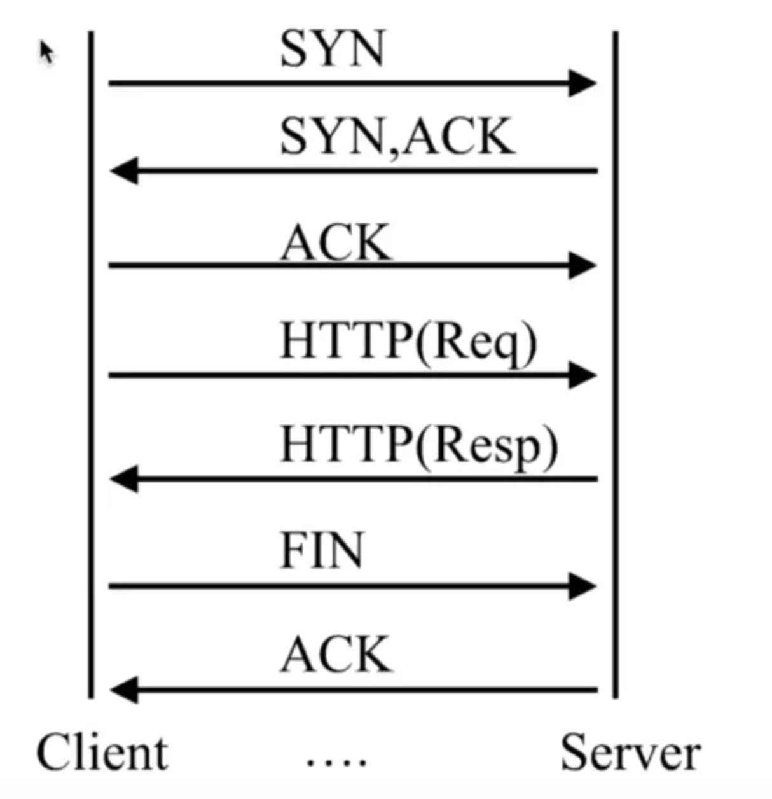
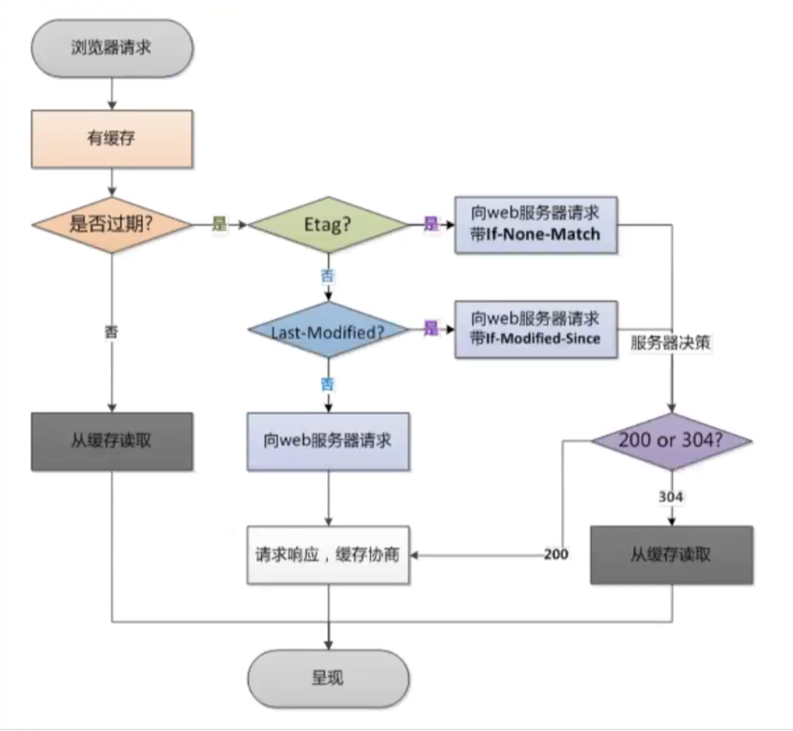
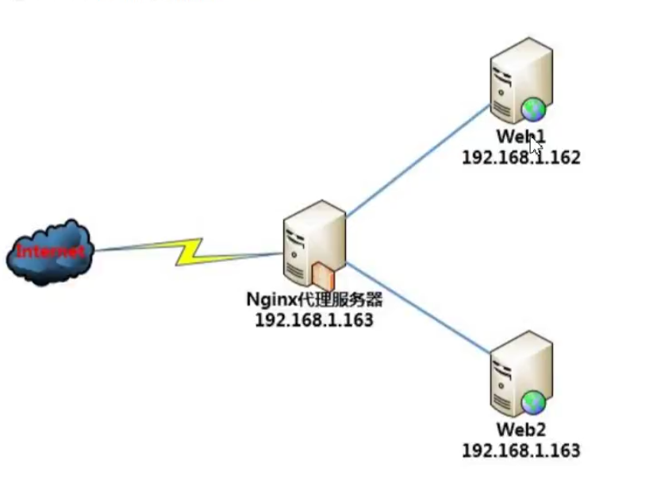

# 核心模块

## 监控nginx客户端的状态

### 模块名

* `--with-http_stub_status_module` 监控 `nginx` 客户端的状态。

### 语法

``` sh
Syntax: stub_status
Default: -
Context: server,location
```

### 示例

```sh{5-8}
[root@iZm5eeens8iab3xz6f0rfZ ~]# vi /etc/nginx/conf.d/default.conf
server {
   ...

   # 添加如下配置
   location /status{

      stub_status on;

   }
   ...
}

``` 

### 访问127.0.0.1/status

```sh
Active connections: 1 
server accepts handled requests
 20 20 69 
Reading: 0 Writing: 1 Waiting: 0 
```

|  字段   | 描述  |
|  ----  | ----  |
| Active connections  | 当前活动的连接数 |
| 20  | 总连接数connection |
| 20  | 成功的连接数connection 失败连接＝（总连接数－成功连接数） |
| 69  | 总共处理的请求数requests |
| Reading  | 读取客户端Header的信息数 请求头 |
| Writing  | 返回给客户端的header的信息数 响应头 |
| Waiting  | 等待的请求数，开启了keepalive |

## 随机主页

### 模块名

* [--with-http_random_index_module](http://nginx.org/en/docs/http/ngx_http_random_index_module.html)在根目录随机选择一个主页显示。

### 语法

``` sh
syntax: 　　random_index on | off
Default:　　 readom_index off;
Contenxt:　　location
```

### 实战

```sh{5-7}
[root@iZm5eeens8iab3xz6f0rfiZ ~]# vi /etc/nginx/conf.d/default.conf
server {
   ...
   # 添加如下配置
   location / {

      root /opt/app; # 添加静态资源目录
      random_index on; # 开启随机访问

   }
   ...
}

``` 

## 内容替换

### 模块名

* [--with-http_sub_module](http://nginx.org/en/docs/http/ngx_http_sub_module.html) 替换内容。

### 语法

### 文本替换

```sh
Syntax:	sub_filter string replacement;
Default:	—
Context:	http, server, location
```

### 只匹配一次

``` sh
Syntax:	sub_filter_once on | off;
Default:	
sub_filter_once on;
Context:	http, server, location
```

### 实战

```sh{4-10}
[root@iZm5eeens8iab3xz6f0rfiZ ~]# vi /etc/nginx/conf.d/default.conf
server {
   ...
   # 添加如下配置
   location / {

      root  /usr/share/nginx/html; 
      index index.html index.htm;
      sub_filter 'world' 'qiandaun'; # 将 world 替换为 qiandaun。
      sub_filter_once on; # 开启全局替换。

   }
   ...
}

``` 

## 限制请求

* 限制主要有两种类型：

  + 连接频率限制： [--with-limit_conn_module](http://nginx.org/en/docs/stream/ngx_stream_limit_conn_module.html)。

  + 请求频率限制： [--with-limit_req_module](http://nginx.org/en/docs/http/ngx_http_limit_req_module.html)。



* 一次连接是建立在 `TCP` 的三次握手和四次挥手之上，  完成一次连接。

* `HTTP2.0` 实现多路复用。 一次连接可以包含多次请求。

### ab

* `Apache` 的 `ab` 命令模拟多线程并发请求，测试服务器负载压力，也可以测试 `nginx` 、 `lighthttp` 、 `IIS` 等其他 `web` 服务器的压力

   - `-n` 总共的请求数。

   - `-c` 并发的请求数。

```sh
ab -n 40 -c 20 http://127.0.0.1/
```

### 请求限制

* `--with-limit_req_module`

####  语法

``` sh
# 可以以 IP 为key zone 为空间的名称 size为申请空间的大小。
Syntax:	limit_req zone=name [burst=number] [nodelay | delay=number];
Default:	—
Context:	http, server, location
```

#### 实战

``` sh
http {
    limit_req_zone $binary_remote_addr zone=req_zone:1m rate=1r/s;
    ...
    server {
        ...
        location / {
            # 缓存区对列 burst =3 个， 不延期，即每秒最多可处理 rate + burst 个。同时处理 rate 个。
            limit_req zone=req_zone burst=3 nodelay;
    }
}
```

* `$binary_remote_addr` 表示远程的IP地址。

* `zone=req_zone:1m` 表示一个内存区域大小为 `10m` , 并且设置名称为 `zone=req_zone:1m `
* `rate=1r/s` 表示请求的速率是 1 秒 1 个请求。

* `zone=req_zone` 表示这个参数对应的全局设置就是 `req_zone` 的那个内存区域。

* `burst=3` 表示请求队列的长度。

* `nodelay` 表示不延迟。

### 连接限制

* `--with-limit_conn_module` 。

####  语法

* `limit_conn_zone`

``` sh
# 可以以 IP 为 key  zone 为空间的名称 size 为申请空间的大小。
Syntax:	limit_conn_zone key zone=name:size;
Default:	—
Context:	http
```

* `limit_conn`

``` sh
# zone名称 numbr 限制的数量。
Syntax:	limit_conn zone number;
Default:	—
Context:	stream, server
```

#### 实战

``` sh
http {
    limit_conn_zone $binary_remote_addr zone=conn_zone:1m;
    ...
    server {
        ...
        location / {
           limit_conn  conn_zone 1; 
    }
}
```

* 表明以 `ip` 为 `key` , 来限制每个 `IP` 访问文件的时候，最多只能有一个在线，否则其余的都要返回不可用。

## 访问控制

* 基于 `IP` 的访问控制  [-http_access_module](http://nginx.org/en/docs/http/ngx_http_access_module.html)

* 基于用户的信任登录 [-http_auth_basic_module.](http://nginx.org/en/docs/http/ngx_http_auth_basic_module.html)

### http_access_module

``` sh
Syntax:	allow address | CIDR | unix: | all;
Default:	—
Context:	http, server, location, limit_except

```

``` sh
Syntax:	deny address | CIDR | unix: | all;
Default:	—
Context:	http, server, location, limit_except
```

``` sh
server {
    location ~ ^/admin.html{
        deny 192.171.207.100;
        allow all;
    }
}
```

``` sh
server {
    location ~ ^/admin.html{
       if($http_x_forwarded_for !~* "^8\.8\.8\.8"){
           return 403
       }
    }
}
```

|  符号   | 含义  |
|  ----  | ----  |
| =   | 严格匹配，如果这个查询匹配，那么停止搜索并立即处理此请求。 |
| ~   | 为区分大小写匹配（可用正则表达式） |
| !~  | 为区分大小写不匹配 |
| ~*  | 为不区分大小写匹配（可用正则表达式）|
| !~* | 为不区分大小写不匹配 | 
| ^~  | 如果把这个前缀用于一个常规字符串，那么告诉 `nginx` 如果路径匹配那么不测试正则表达式| 

### http_auth_basic_module

``` sh
Syntax:	auth_basic string | off;
Default:	
auth_basic off;
Context:	http, server, location, limit_except
```

``` sh
Syntax:	auth_basic_user_file file;
Default:	—
Context:	http, server, location, limit_except
```

``` sh
server{
    auth_basic '请登录';
    auth_basic_user_file /opt/app/users.txt;
}
```

## 静态资源 Web 服务

### 静态资源和动态资源

* 静态资源

  +  一般客户端发送请求到 `web` 服务器， `web` 服务器从内存在取到相应的文件，返回给客户端，客户端解析并渲染出来。

* 动态资源

  + 一般客户端请求的动态资源，先将请求交于 `web` 容器， `web` 容器连接数据库，数据库处理数据后，将内容交给 `web` 服务器， `web` 服务器返回给客户端解析渲染处理。

|  类型   | 种类  |
|  ----  | ----  |
| 浏览器渲染 | HTML、CSS、JS |
| 图片      | JPEG、GIF、PNG |
| 视频      | FLV、MPEG |
| 下载文件   | Worl、Excel |

### CDN

* `CDN` 的全称是 `Content Delivery Network` , 即内容分发网络。

* `CDN` 系统能够实时地根据网络流量和各节点的连接，负载状态以及到用户的距离和相应时间等综合信息将用户的请求重新导向离用户最近的服务节点上，其目的是使用户可就近取得所需内容，解决 `Internet` 拥挤的状况，提高用户访问网站的响应速度。


### 配置语法

#### sendfile

* 不经过用户内核发送文件。

|  类型   | 说明  |
|  ----  | ----  |
| 语法 | sendfile on/off |
| 默认      | sendfile off; |
| 上下文     | http、 server 、location、 if in location |

#### tcp_nopush

* 在 `sendfile` 开启的情况下，合并多个数据包，提高传输效率。

|  类型   | 说明  |
|  ----  | ----  |
| 语法     | tcp_nopush on/off |
| 默认     | tcp_nopush on; |
| 上下文    | http、 server 、location |

#### tcp_nodedey

* 在 `keepalive` 连接下， 提高网络的传输实时性。

|  类型   | 说明  |
|  ----  | ----  |
| 语法     | tcp_nodedey on/off |
| 默认     | tcp_nodedey on; |
| 上下文    | http、 server 、location|

#### gizp

* 压缩文件可以节约带宽和提高网络传输效率。

|  类型   | 说明  |
|  ----  | ----  |
| 语法     | gizp on/off |
| 默认     | gizp on; |
| 上下文    | http、 server 、location|

#### gizp_comp_level

* 压缩比率越高，文件被压缩的体积越小。

|  类型   | 说明  |
|  ----  | ----  |
| 语法     | gizp_comp_level level |
| 默认     | gizp_comp_level 1; |
| 上下文    | http、 server 、location|

#### gizp_http_version

* 压缩版本。

|  类型   | 说明  |
|  ----  | ----  |
| 语法     | gizp_http_version 1.0/1.1 |
| 默认     | gizp_http_version 1.1; |
| 上下文   | http、 server 、location|

#### http_gzip_static_module

* 先找磁盘上同名的 `.gz` 文件，这个文件是否存在，节约 `CPU` 的压缩时间和性能损耗。

* `http_gizp_static_module` 预计 `gizp` 模块。

* `http_gunzip_module` 应用支持 `gunzip` 的压缩方式。

|  类型   | 说明  |
|  ----  | ----  |
| 语法     | zip_static on/off |
| 默认     | zip_static off |
| 上下文   | http、 server 、location|

#### 案例

* `/etc/nginx/conf.d/default.conf`

``` nginx
location ~ .*\.(jpg|png|gif)$ {
    gizp off;
    root /data/www/images;
}

location ~ .*\.(html|js|css)$ {
     gizp on;                   # 启用压缩
     gzip_min_length 1k;        # 只压缩超过1k的文件
     gizp_http_version 1.1;     # 启用 gzip 压缩所需要的的 HTTP 最低版本
     gzip_comp_level 9;         # 压缩级别，压缩比率越高，文件被压缩的体积越小
     gizp_types text/css application/javascript;  # 进行压缩文件的类型
     root /data/www/html;
}

location ~ ^/download{
    gzip_static on;  # 开启压缩
    tcp_nopush  on;  # 不要着急发，赞一波在发。
    root  /data/www; # 注意此处目录是 `/data/www` 而不是 `/data/www/download`
}
```

## 浏览器缓存



|  类型   | 说明  |
|  ----  | ----  |
| 检查是否过期     | Expires 、Cache-control（max-age） |
| Etag           | Etag |
| Last-Modified  | Last-Modified |

### expires

* 添加 `Cache-control` 、 `Expires` 头。

|  类型   | 说明  |
|  ----  | ----  |
| 语法     | expires time） |
| 默认     | expires off; |
| 上下文   | http、 server 、location |

``` nginx
location ~ .*\.(jpg|png|gif)$ {
    expires 24h;
}
```

## 跨域

* 跨域是指一个域下的文档或脚本试图去请求另一个域下的资产的资源。

|  类型   | 说明  |
|  ----  | ----  |
| 语法     | add_header name value |
| 默认     | add_header --; |
| 上下文   | http、 server 、location |

``` nginx
location ~ .*\.json$ {
   add_header Access-Control-Allow-Origin http://localhost:3000;
   add_header Access-Control-Allow-Methods GET,POST;
   root /data/json;
}
```

## 防盗链

* 防止网站资源被盗用。

* 保证信息安全。

* 防止流量过量。

* 需要区别哪些请求是非正常的用户请求。

* 使用 `http_refer` 放盗链。

|  类型   | 说明  |
|  ----  | ----  |
| 语法     | valid_referers none 、block、server_names、IP |
| 默认     | - |
| 上下文   |  server 、location |

``` sh
location ~ .*\.(jpg|png|gif)$ {
     gizp on;                   # 启用压缩
     gzip_min_length 1k;        # 只压缩超过1k的文件
     gizp_http_version 1.1;     # 启用 gzip 压缩所需要的的 HTTP 最低版本
     gzip_comp_level 9;         # 压缩级别，压缩比率越高，文件被压缩的体积越小
     gizp_types text/css application/javascript;  # 进行压缩文件的类型
     valid_referers none blocked 47.104.184.134;
     if($invalid referer){  # 验证通过为 0， 不通过为1
         return 403
     }
     root /data/images;
}
```

## 代理服务器

### 配置

|  类型   | 说明  |
|  ----  | ----  |
| 语法     | proxy_pass URL |
| 默认     | - |
| 上下文   |  server 、location |

### 正向代理

* 正向代理的对象是客户端，服务器端看不到真正的客户端。

* 通过公司代理服务器上网。

``` nginx
server {
    listen       80;
    server_name  localhost nginx.tangll.cn;

    resolver 8.8.8.8; 
    location / {
        proxy_pass http://$http_host$request_uri;
    }

    error_page   500 502 503 504  /50x.html;
    location = /50x.html {
        root   /usr/share/nginx/html;
    }
}
```

* `resolver` 为 `DNS` 解析, 这里填写的 `IP` 为 `Google` 提供的免费 `DNS` 服务器的IP地址。

* `proxy_pass` 配置代理转发。

* `$http_host` 就是我们要访问的主机名。

* `$request_uri` 就是我们后面所加的参数。



### 反向代理

* 反向代理的对象的服务端，客户端看不到真正的服务端。

* `nginx` 代理应用服务器。

``` nginx
server {
    listen       80;
    server_name  localhost nginx.tangll.cn;
    location / {
        root   /usr/share/nginx/html;
        index  index.html index.htm;
    }
  
    #设置代理
    #location ~ /test.html$ {
    #    proxy_pass http://127.0.0.1:8080;
    #}

    error_page   500 502 503 504 404  /50x.html;
    location = /50x.html {
        root   /usr/share/nginx/html;
    }
}
```

## 负载均衡


* 使用集群是网站决绝高并发，海量数据问题的常用手段。

* 当一台服务器的处理能力，存储空间不足，不要企图去换更强大的服务器，对大型网站而言，不管多么强大的服务器，都满足不了网站持续增长的业务需求。

* 在这种情况下，更恰当的做法是增加一台服务器分担原有服务器的访问及存储压力。通过负载均衡调度服务器，将来自浏览器的访问请求分发到应用服务器集群的任何一台服务器上，如果有更多的用户。就在集群加入更多的应用服务器，是应用服务器的负载压力不再成为整个网站的瓶颈。

### upstream

* `nginx` 把请求转发到后台的一组 `upstream` 服务池。

|  类型   | 说明  |
|  ----  | ----  |
| 语法     | upstream name {} |
| 默认     | - |
| 上下文   |  http |

``` nginx
upstream qianduan {
    server http://127.0.0.1:3000 weight 10;
    server http://127.0.0.1:4000;
    server http://127.0.0.1:5000;
}
server {
    location / {
        proxy_pass http://http://127.0.0.1;
    }
}
```

### 后端服务器调试状态

|  状态   | 说明  |
|  ----  | ----  |
|  down       |   当前服务器不参与负载均衡。 |
|  backup     |   当其节点都无法使用时的备用的服务器。 |
|  max_fails  |   允许请求失败的次数，到达最大次数就会休眠。 |
|  fail_timeout  |  经过max_fails失败后，服务暂停的时间，默认10秒。 |
|  max_conns  |  限制每个server最大的接受的连接数，性能高的服务器可以连接数多一些。 |

``` nginx
upstream qianduan {
    server http://127.0.0.1:3000 down;
    server http://127.0.0.1:4000 backup;
    server http://127.0.0.1:5000 max_fails=1 fail_timeout=10; 
}
server {
    location / {
        proxy_pass http://http://127.0.0.1;
    }
}
```

### 分配方式

|  <div style="width:200px" >类型</div>   | 说明  |
|  ----  | ----  |
|  轮询（默认） |   每个请求按按时间顺序逐一分配到不同的后端服务器，如果后端服务器 `down` 掉，就会自动剔除。 |
| weight（加权轮询） | 指定轮询几率， `weight` 和访问比率成正比，用于后端服务器性能不均的情况。 |
| ip_hash | 每个请求按访问 `ip` 的 `hash` 结果分配，这样每个访客固定访问一个后端服务器，可以解决 `session` 问题。|
| least_conn | 哪个机器上的连接少就发给谁。|
| url_hash(第三方) | 按访问的URL地址来分配，每个 `URL` 都定向到同一个后端服务器上（缓存）。 |
| fair（第三方） |按后端服务器的相应时间来分配请求，响应时间短优先分配。 |
| 自定义hash |hask自定义key |

``` nginx
upstream qianduan {
    ip_hash;
    server http://127.0.0.1:3000 down;
    server http://127.0.0.1:4000 backup;
    server http://127.0.0.1:5000 max_fails=1 fail_timeout=10; 
}
```

## rewrite

* 可以实现 `URL` 重写及重定向。

### 用途

* `URL` 页面跳转。

* 兼容就版本。

* `SEO` 优化(伪静态)。

* 维护（后台维护、流量转发）。

* 安全（伪静态）。

### 语法

|  类型   | 说明  |
|  ----  | ----  |
|  语法       |   rewrite regex replacement [flag] |
|  默认       |   -  |
|  上下文     |   server、location、if |

* `regex` 正则表达式指的是被改成的路径。

* `replacement` 目标要替换成哪个 `URL` 。

* `flag` 标识。

``` sh
rewrite ^(.*)$ /www/reparing.html break
```

### flag

* 标志位是标识规则对应的类型。

|  类型   | 说明  |
|  ----  | ----  |
|  last         |  先匹配自己的 `location` , 然后通过 `rewrite` 规则新建一个请求再次请求服务端。 |
|  break        |   先匹配自己的 `location` , 然后声明周期会在当前的 `location` 结束，不再进行后续匹配。|
|  redirect     |   返回 `302` 临时重定向，以后还会请求这个服务器。 |
|  permanent    |   返回 `301` 永久重定向，以后会直接请求永久重定向的域名。|

### rewrite优先级

* 先执行 `server` 中的 `rewrite` 指令。

* 执行 `location` 匹配。

* 在执行 `location` 中的 `rewrite` 。

### location中的优先级

* 等号类型（=）的优先级最高，一旦匹配成功，则不再查找其他配置项。

* `^~` 类型表达式。一旦匹配成功，则不再查找其他的匹配项。

* 正则表达式类型 `(~~*)` 的优先级次之。如果有多个 `location` 的正则能匹配的话，则使用正则表达式最长的那个。

* 常规字符串匹配类型按前端匹配。
