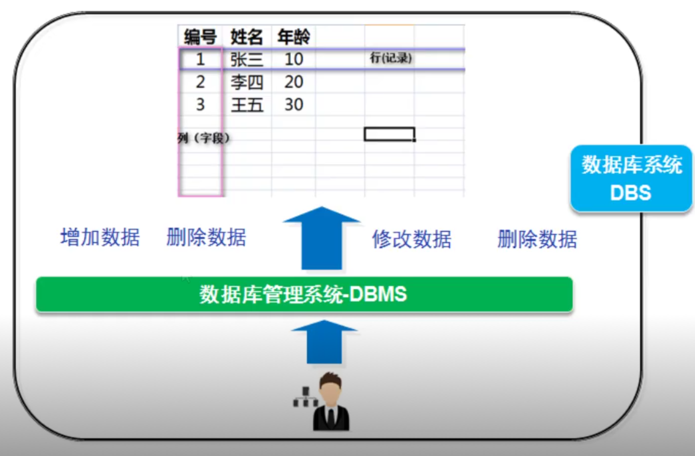

# 数据库介绍

## 数据库能做什么？

* 存储大量数据，方便检索和访问。

* 保持数据信息一致，完整。

* 共享和安全。

* 通过组合分析，产生新的有用信息。

## 数据库基本概念

### 实体

只要是客观世界存在的、可以被描述出来的都是实体。

### 数据库(DB)

数据库就是数据仓库，可以存放结构化的数据。

### 数据库关系系统(DBMS)

是一种软件系统，提供操作数据库的环境，可以通过数据库管理系统对数据进行插入、删除、查询和删除操作。

### SQL

结构化查询语言，专门用来和数据库进行交流的语言，几乎所有的 `DBMS` 都支持 `SQL` 。

### SQL规范

1. SQL 语句不区分大小写，建议 SQL 关键字大写、表名和列表小写。

2. 命令用分号结尾。

3. 命令可以缩进和换行，一种类型的关键字放在一行。

4. 可以写单行和多行注释， `#` 单行注释， `/***/` 多行注释。

### SQL语言

* `DML（data manipulation language）`
    它们是 `SELECT` 、 `UPDATE` 、 `INSERT` 、 `DELETE` ，就象它的名字一样，这 4 条命令是用来对数据库里的数据进行操作的语言。

* `DDL（data definition language）`
`DDL` 比 `DML` 要多，主要的命令有 `CREATE` 、 `ALTER` 、 `DROP` 等。
`DDL` 主要是用在定义或改变表 `（TABLE）` 的结构，数据类型，表之间的链接和约束等初始化工作上，他们大多在建立表时使用 。

* `DCL（Data Control Language）`
    是数据库控制功能。是用来设置或更改数据库用户或角色权限的语句，
    包括 `grant,deny,revoke等）` 语句。在默认状态下，只有 `sysadmin,dbcreator,db_owner或db_securityadmin` 等人员才有权力执行DCL。

* `TCL - Transaction Control Language`
  

    事务控制语言。

    - `COMMIT` 保存已完成的工作。
    - `SAVEPOINT` 在事务中设置保存点，可以回滚到此处。
    - `ROLLBACK` 回滚。
    - `SET TRANSACTION` 改变事务选项。

### 数据表

* 表是数据库中包含所有数据的数据库对象，也是其他对象的基础。

* 表定义是一列的集合，数据在表中是按照行和列的数据组织的，用来存放数据。

* 行也成为记录存放一个个实体，列称为字段用来描述实体的某一个属性。

