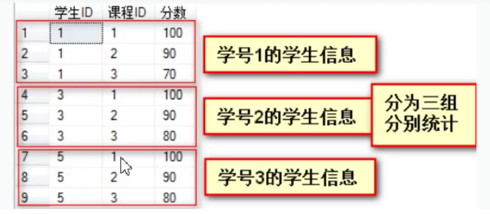

# 聚合

## 什么是聚合函数

对一组值进行计算，并返回计算后的值，一般用来统计。

### SUM

累加所有行的值。

``` sql
#计算ID=1的学生的总分
SELECT SUM(grade) AS '总分'
FROM score;
```

### AVG

计算平均值。

``` sql
SELECT AVG(grade)
FROM score;
```

### MAX

计算最大值。

``` sql
SELECT MAX(grade) FROM score ;
```

### MIN

计算最小值。

``` sql
SELECT MIN(grade) FROM score ;
```

### COUNT

计算总记录数量。

``` sql
SELECT COUNT(*) FROM score;
```

## 分组

分组查询就是按某列的值进行分组，相同的值分成一组，然后可以对此组内进行求平均值、求和的操作。



### 语法

``` sql
SELECT 列名，查询表达式
FROM   <表名>
WHERE  <条件>
GROUP BY <分组字段>
HAVING  分组后的过滤条件
ORDER BY 列名 [ASC,DESC]
LIMIT 偏移量，条数
```

::: tip
SELECT 列表中只能包含:

* 被分组的列。
* 为每个分组返回一个值的表达式，如聚合函数。

:::

## 子查询

* 子查询就是指出现在 `SQL` 语句中的 `SELECT` 语句，必须始终出现在圆括号中。

* 子查询可以包含多个关键字或条件。

* 子查询的外层查询可以是 `SELECT` 、 `INSERT` 、 `UPDATE` 、 `SET` 等。

* 字查询可以返回常量、一行数据、一列数据或其他字查询。

### 比较运算符的子查询

* `=` 等于。
* `>` 大于。
* `<` 小于。
* `>=` 大于等于。
* `<=` 小于等于。
* `<>` 不等于。
* `!=` 不等于。
* `<=>` 安全不等于。

### 查询年龄大于平均年龄的学生

``` sql
SELECT ROUND(AVG(age), 2)
FROM student;

SELECT *
FROM student
WHERE age > (
	SELECT ROUND(AVG(age), 2)
	FROM student
)
```

### ANY 与 SOME 与 ALL

* `ALL` 全部。
* `SOME` 某些。
* `ALL` 全部。

``` sql
# 年龄大于陕西省任何一位同学
SELECT *
FROM student
WHERE age > ANY (
	SELECT age
	FROM student
	WHERE province = '山西省'
)

# 年龄大于陕西省某些同学
SELECT *
FROM student
WHERE age > SOME (
	SELECT age
	FROM student
	WHERE province = '山西省'
)

# 年龄大于陕西省所有同学
SELECT *
FROM student
WHERE age > ALL (
	SELECT age
	FROM student
	WHERE province = '山西省'
)

```

### IN 与 NOT IN

`IN` 操作符允许在 `WHERE` 子句中规定多个值。

``` sql
SELECT *
FROM student
WHERE id IN (
	SELECT DISTINCT student_id
	FROM score
)
```

### EXISTS 与 NOTEXIST

``` sql
SELECT *
FROM
WHERE EXISTS 
    (SELECT DISTINCT student_id
    FROM score
    WHERE student_id =1 )
```
