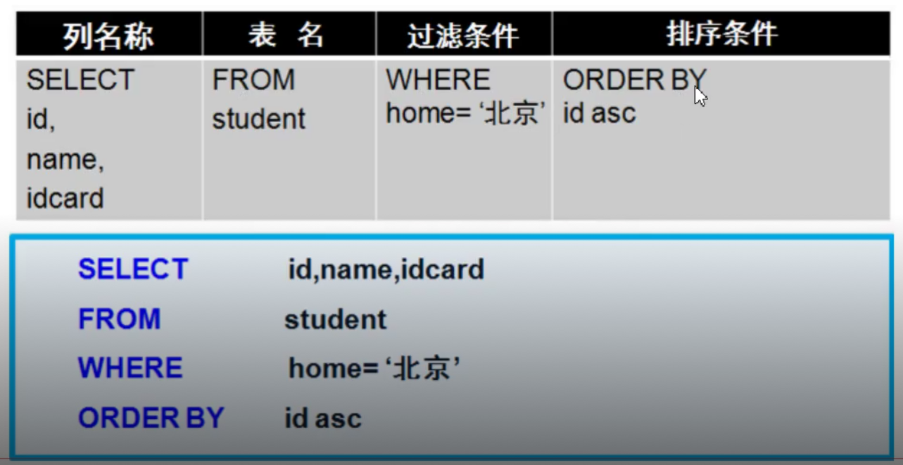

# SQL

## SQL是什么？

`Structured Query Language` 结构化查询语言。

### 为什么要用SQL？

* 使用界面操作数据不方便。

* 我们需要通过应用程序去操作数据库。

## SQL组成

* `DDL（data definition language）` 数据库定义语言

主要的命令有 `CREATE` 、 `ALERT` 、 `DROP` 等， `DDL` 主要是用在定义或者改变表结构、
数据类型、表之间的链接和约束等初始化工作，他们大多建立在表使用。

* `DML（data manipulation language）` 是数据库操作语言

    它们是 `SELECT` 、 `UPDATE` 、 `INSERT` 、 `DELETE` ，就象它的名字一样，这 4 条命令是用来对数据库里的数据进行操作的语言。

* `DCL（Data Control Language）`
    是数据库控制功能。是用来设置或更改数据库用户或角色权限的语句，
    包括 `grant,deny,revoke等）` 语句。在默认状态下，只有 `sysadmin,dbcreator,db_owner或db_securityadmin` 等人员才有权力执行DCL。

* `TCL - Transaction Control Language`
  

    事务控制语言。

    - `COMMIT` 保存已完成的工作。
    - `SAVEPOINT` 在事务中设置保存点，可以回滚到此处。
    - `ROLLBACK` 回滚。
    - `SET TRANSACTION` 改变事务选项。

## 算数运算符

|运算符|说明|
|---|---|
|+|  加运算符，求两个数或者表达式相加的和，如 1+1|
|-|  减运算符，求两个数或者表达式相减的差，如 4-1|
|*|  乘运算符，求两个数或者表达式相减的积，如 4*2|
|/|  除运算符，求两个数或者表达式相减的商，如6/4的值为1|
|%|  除运算符，求两个数或者表达式相减的余数，如6%4的值为2|

   

## 逻辑运算符

|运算符|说明|
|---|---|
|AND |  当仅两个布尔值表达式为都true，返回true|
|OR |  当仅两个布尔值表达式为都false，返回false|
| NOT |  布尔表达式的值取反|

## 比较运算法

|运算符|说明|
|---|---|
| =  |  等于|
| >  |  大于|
| < |  小于|
| <>|  不等于|
| >=|  大于等于|
| <=|  小于等于|
| !=|  不等于|

## 插入数据

### 语法

``` sql
INSERT [INTO] 表名 [(列名)] VALUES (值列表)
```

####  向学生表插入一条记录，姓名张三，身份证123456，年龄30，城市北京

``` sql
INSERT INTO [school].[student]
(name,idcard,age,city)
VALUES
('张三','123456',30,'北京')
```

::: warning

* 每次插入一行数据，不能只插入一部分数据，插入的数据是否有效将按照整行的完整性要求来校验。

* 每个数据值的数据类型，精度、位数必须与要求的列名精度匹配。

* 不能为标识符指定值。

* 如果某个字段设置为不能为空，则必须插入数据。

* 插入数据时还要符合检查性约束的要求。

* 有缺少的列，可以使用 `DEFAULT` 关键字来代替插入的实际值。

:::

## 更新数据

### 语法 

``` sql
UPDATE 表名 SET 列名 = 更新值 [where 更新条件]
```

#### 更新ID等于7的学生年龄为40，城市为上海

``` sql
UPDATE
    [school].[student]
SET
    age = 40,
    city = '上海'
WHERE
    id = 7
```

::: warning

* 多列时用逗号跟开，一定要加条件以免错误更新。

* 多个联合条件使用 `AND` 。 `id=7 and idcard=410787` 。

* 判断某个字段是否为空 。 `email is null or email=`
:::

## 删除操作 

### 语法

``` sql
DELETE [FROM] 表名 [where <删除条件>]
```

### 删除记录

删除 `ID=7` 的学生记录。 

``` sql
DELETE FROM [school].[student] WHERE id=7
```

## TRUNCATE 截断表

截断整个表的数据。

### 语法

``` sql
TRUNCATE TABLE 表名
```

### 截断学生表

``` sql
TRUNCATE TABLE student
```

::: warning
数据全部清空、但表结构、列、约束等不被改动。不能用于有外键约束的表，标识列重新开始编号，因为删除的数据不会写入日志，数据也不能被恢复，所以工作中请尽量不要使用。
:::

## 查询

* 查询是从客户端发情查询请求数据库服务器，并从数据库返回查询结果的过程。

* 每次执行查询只是从数据表提取数据，并按表的形式呈现出来。

* 查询产生的是虚拟表，并不会保存起来。

### 语法

``` sql
SELECT <列名>
FROM   <表名>
[WHERE <查询条件表达式>]
[ORDER BY <排序的列名> [ASC或DESC]]
```

### 排序

- 使用`ORDER BY`进行排序。

- `ASC`升序。

- `DESC`降序。

- 默认按升序排列。

查询北京的学生信息，并按照ID正序排列。

``` sql
SELECT
    id,
    name,
    idcard,
    age,
    city
FROM
    student
WHERE
    home = '北京'
ORDER BY
    id ASC
```

::: warning
ORDER BY 多列的时候，先按照第一个column name排序，在按照第二个column name排序。
:::



### 别名
使用`AS`关键字。
``` sql
SELECT
    id,
    name,
    idcard,
    age,
    city AS home
FROM
    student
WHERE
    city = '山东'
ORDER BY
    id asc
```

### 查询空行

``` sql
SELECT
    id,
    name,
    idcard,
    age,
    city AS home
FROM
    student
WHERE
    city IS NULL
    OR city = ''
```

### 常量列

``` sql
SELECT
    id,
    name,
    idcard,
    age,
    '中国' AS conutry
FROM
    student
```

::: warning
单引号' ' 很重要，否则编译时会把其看成查询参数，从而提示参数未指定错误
:::


### limit

`limit`子句用于限制查询结果返回的数量，常用于分页查询。

- 第一个参数：从哪儿开始查 , 第二个参数：查几条 。

```sql
select * from tableName limit i,n
# tableName：表名
# i：为查询结果的索引值(默认从0开始)，当i=0时可省略i
# n：为查询结果返回的数量
# i与n之间使用英文逗号","隔开
```

```sql
select * from Customer LIMIT 10;
# 检索前10行数据，显示1-10条数据
select * from Customer LIMIT 1,10;
# 检索从第2行开始，累加10条id记录，共显示id为2....11
select * from Customer limit 5,10;
# 检索从第6行开始向前加10条数据，共显示id为6,7....15
select * from Customer limit 6,10;
# 检索从第7行开始向前加10条记录，显示id为7,8...16
```
<!-- ### DISTINCT -->