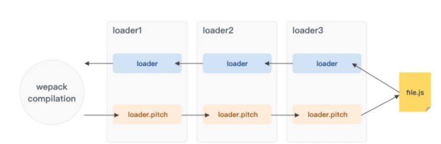
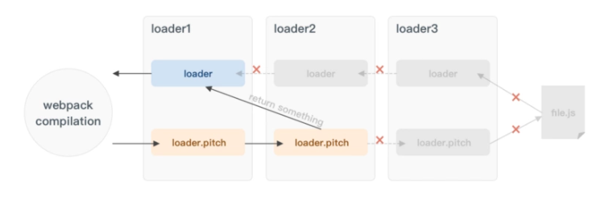

# pitch loader

* 一个`laoder`的执行会分为两个阶段：

  + `pitch`阶段，一个非必须的`pitch`函数。

  + `normal`阶段，一个必须存在的`normal`函数。

* `pitch loader` 是用来阻断`loader chain`的。

``` js
module.exports = function(source) {
    console.log("normal loader is running");
    return source;
};
// remainingRequest:loader 链中排在自己后面的 loader 以及资源文件的绝对路径以!作为连接符组成的字符串。
// precedingRequest：loader 链中排在自己前面的 loader 的绝对路径以!作为连接符组成的字符串。
// data：每个 loader 中存放在上下文中的固定字段，可用于 pitch 函数 给 normal 函数之间传递数据。
module.exports.pitch = function(remainingRequest, precedingRequest, data) {
    console.log("pitch loader is running");
};
```

* 比如`a!b!c!`:

  + 正常调用的顺序应该是：

    - `c` > `b` > `a`。

  + 但是真正的调用顺序是：

    - `a.pitch()` > `b.pitch()` > `c.pitch()` > `c` > `b` > `a`。





``` js
use: ["a-loader", "b-loader", "c-loader"];
```

``` js
-a - loader `pitch` |
  -b - loader `pitch` |
    -c - loader `pitch` |
     -requested module is picked up as a dependency |
    -c - loader normal execution |
  -b - loader normal execution |
-a - loader normal execution
```

* 如果其中任何一个`pitch laoder`返回了值，就相当于在它及它右边的`laoder`已经执行完毕完了。

* 假如`b`返回了字符串`result b`, 接下来只有`a`会系统调用，且`a`的`laoder`接收到的参数是`result b`。
