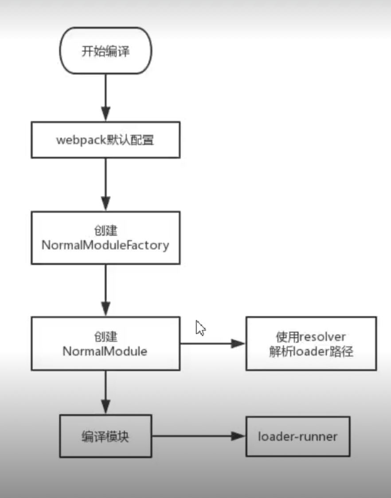

# loader 运行流程

1. `Complier.js`中会将用户配置与默认配置合并，其中就包括了`loader`部分。

2. `webpack`就会根据配置创建两个关键的对象。`NormalModuleFactory`和`ContextModuleFactory`。它们相当于是两个类工厂，通过其可以创建对应的`NormalModule`和`ContextModule`。

3. 在工厂创建`NormalModule`实例之前还要通过`loader`的`resolver`来解析`loader`路径。

4. 在`NormalModule`实例创建之后，则会通过其`.build()`方法来进行模块的创建。构建模块的第一步就是使用`laoder`来加载并处理模块内容。而`loader-runner`这个库就是`webpack`中`loader`的运行器。

